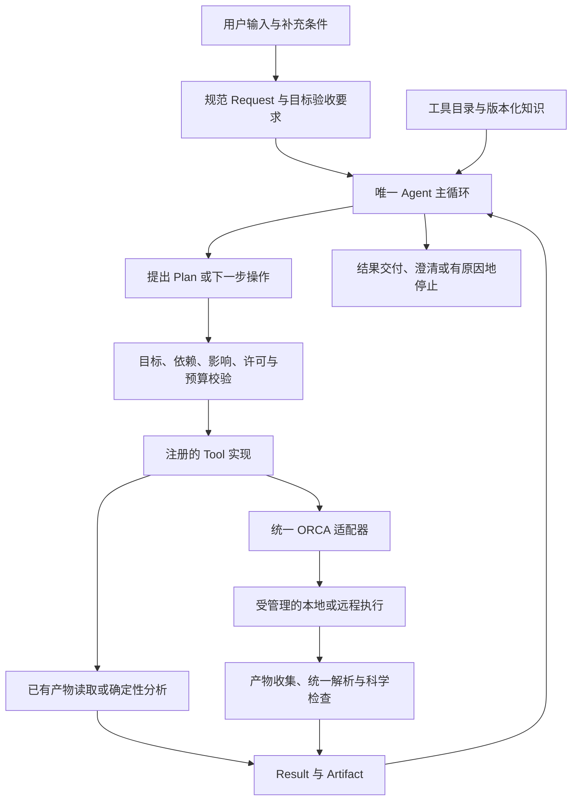

# 通用 ORCA 计算 Agent：从零建设骨架方案

> 版本：2.0  
> 日期：2026-10-06  
> 用途：新项目的产品边界、运行时契约、开发原则与分阶段验收基准。  
> 状态：设计方案，不代表代码已实现或能力已验证。  
> 执行顺序：先本地真实测试，再接入服务器或集群。

本版整合并替代本文档的 1.0 版。面向全新项目，不以旧项目进度、数据库或运行时框架为前提。文中的目录和接口是建设约定，不是已经存在的代码；不据此自动启动全部阶段。

阅读顺序：第 1—4 节确定产品、权威来源和目标；第 5—11 节规定运行契约；第 12—15 节用于组织代码、拆分任务和验收；第 16 节提供参考来源。

## 1. 产品定位与范围

### 1.1 要建设的系统

建设一个能够理解自然语言科学需求，使用 ORCA 及必要辅助工具，组织计算、查询已有证据、进行可复算分析，并根据结果自主调整后续工作的 Agent。

产品应同时支持三类任务：

| 任务 | 典型行为 |
| --- | --- |
| 新计算 | 从对象、条件和目标出发，规划并执行真实科学操作 |
| 已有结果分析 | 导入或引用文件，发现数据，解释可支持的结论和缺项 |
| 计算与分析交替 | 检查已有证据，仅在需要且已授权时补算，再更新结论 |

构象、热化学、光谱、NEB 等属于能力实例，不构成固定主流程。长期覆盖常见分子 DFT，并按实际需求扩展 ORCA 的其他量子化学方法。

“通用”由可组合能力、开放证据查询和反馈决策体现。每项实际启用能力仍有明确适用范围，不能承诺任意 ORCA 输入或任意科学问题均可自动完成。

### 1.2 首个可用版本的要求

首个可用版本必须同时证明：

1. 自然语言请求能驱动真实 ORCA 计算。
2. 能依据真实失败，在有限预算内作合法修复。
3. 能依据成功结果，调整计划并执行新增的必要操作。
4. 能导入、发现和查询已有结果，不因缺少标准字段就要求重算。
5. 能完成至少一种跨结果的确定性派生量分析。
6. 能在证据不足、不适用或预算耗尽时准确停止并交付部分结果。

先用小体系验证这些行为，再扩大科学能力与计算规模。

### 1.3 如何衡量覆盖范围

逐步建立 30—50 个代表性科学请求，按任务族、体系、方法、环境和交付方式分布，冻结一部分作为保留测试。该规模是能力评测建设目标，不是阶段 A 的启动前提。

每项能力分别记录：可构造输入、可执行、可解析、可科学验证、可完成目标、可自动修复，以及各项证据对应的版本和适用范围。不得压缩成单一的 `supported: true`。

发布时报告测试分布、通过数、部分完成数、未验证数和成本。样例通过率不能直接表述为“支持大多数 ORCA 功能”。

## 2. 必须遵守的开发原则

| 编号 | 不可绕过的约束 |
| --- | --- |
| P01 | 第一交付是真实 ORCA 计算及有界失败事实；基础设施必须服务于实际用例。 |
| P02 | 长期运行时领域对象仅有 Request、Plan、Step、Tool、Run、Result、Artifact。 |
| P03 | 采用一个 Agent 决策主循环；Tool 是执行边界；Plan 组合 Step，不固定 Opt/Freq/SP 协议。 |
| P04 | ORCA 输入、执行管理、解析和科学检查各有一套生产责任链；后端差异通过明确适配实现，不维护隐式备用链路。 |
| P05 | 模型提出意图、计划、参数和修复建议；程序决定是否可执行及科学检查是否通过。 |
| P06 | 模型不能执行任意 shell/Python、修改源码、修改执行许可或宣告科学成功。 |
| P07 | 用户目标及最低证据要求独立于 Plan；计划修订不能偷换物理量、条件或验收标准。 |
| P08 | 模糊输入可以逐步澄清；默认、继承、推断和用户明确要求必须可区分。 |
| P09 | 每个新结果先检查其对目标和计划的影响，再选择下一步；成功反馈与失败反馈同等重要。 |
| P10 | 证据读取成功、科学输出通过和用户目标完成分别记录，不能互相代替。 |
| P11 | 初始几何与历史原始证据不可覆盖；每次尝试独立；成功科学端口不得发布未验证数值或未收敛优化结构。 |
| P12 | 原始证据可发现、可有界查询；未注册性质可以作为观察查看，但不能绕过科学检查。 |
| P13 | 只读查询不得暗中启动转换或计算；执行影响、文件依赖和成本在执行前明确。 |
| P14 | 重试、模型调用、计划修订、内部子计算和实际资源均有有限预算；换 ID、恢复或暂停不清零。 |
| P15 | 预期失败保留结构化诊断与原始文件；无静默模拟回退、猜测数值或无条件重试。 |
| P16 | 新能力通过局部参数、Tool、适配与测试扩展；主循环不得出现按具体科学工具名称分支的逻辑。 |
| P17 | 工具目录、参数 schema、执行校验与输出声明来自同一工具定义，避免多套同义协议。 |
| P18 | 文件、检索资料和工具输出作为不可信数据处理，不能授予权限；凭据不进入模型上下文或产物。 |
| P19 | 阶段名只进入文档、任务和提交记录；离线模拟、真实模型、真实 ORCA、真实集群证据分别报告。 |
| P20 | 同一 Run 只有一个协调者；并发额度在整个执行环境中生效，不能被多个 Run 绕过。 |

必要的局部类型结构允许存在，例如尝试、检查项、成员清单、方法配置和执行句柄。限制的是独立领域生命周期和重复框架，不是类型安全。

不提前建设 Kernel、Reducer、Service/Repository 分层、事件总线、分布式数据库或多 Agent 平台；不迁移旧项目的数据库、outbox、launch ticket 或旧对话运行协议。按职责提取函数和模块，避免巨型 Agent 文件，也避免大量空抽象。

## 3. 架构、对象与权威来源

### 3.1 总体结构



所有需要执行或访问产物的动作经过 Tool。普通知识回答无需计算 Plan；数据查询仍受同一工具边界管理，但不强行创建 ORCA 计算步骤。

### 3.2 七个领域对象

| 对象 | 核心职责 | 边界 |
| --- | --- | --- |
| Request | 用户原文、规范目标、对象与条件、默认来源、未决歧义、验收要求、版本 | 不保存进程状态；不是模型可随意重写的目标草稿 |
| Plan | 当前 Step 依赖图、目标到证据的映射、Request 版本、计划修订 | 实现目标，不拥有修改目标或最低检查的权力 |
| Step | Tool 名称、类型化参数、输入引用、前置检查、逻辑步骤身份 | 不直接管理进程或判断科学成功 |
| Tool | 参数与产物契约、执行影响、适用范围、实现、检查与修复候选 | 不各自运行 Agent 循环或工作流引擎 |
| Run | 执行状态、Request/Plan 绑定、尝试、许可、累计预算、句柄、协调状态 | 不复制全部科学内容；不增加平行 Job/Record 生命周期 |
| Result | 操作事实、逐输出科学检查、合格数值与引用、证据观察、诊断 | 不用模型文本补数值；操作成功不等于科学成功 |
| Artifact | 不可变文件或结构化产物、来源、hash、角色、成员清单 | 不自行认证科学含义；外部产物不伪造生成 Run |

尝试状态放在 Run，科学调用定义放在 Step。工具注册表保存 Tool 定义；文件存储保存其余对象及版本，不为每个局部结构增加独立服务。

### 3.3 谁决定什么

| 内容 | 权威来源 | 模型可以做什么 |
| --- | --- | --- |
| 用户想回答的问题 | 用户明确输入及可追溯的规范化 Request | 提议解释、识别歧义、请求补充 |
| 已支持能力的最低证据 | 版本化能力规则和确定性检查代码 | 选择适用能力，不能删除最低要求 |
| 达成目标的路径 | 通过校验的 Plan | 规划、组合、调整顺序和修复 |
| 资源、文件范围与执行许可 | 用户授权、项目配置及 Run 快照 | 在范围内提出调用 |
| 数值、执行事实、检查状态 | 原始产物、受控解析、后端与检查程序 | 阅读、比较、解释 |
| 结论强度与剩余疑问 | 已有证据及明确限制 | 给出有依据的解释与建议，不越过证据 |

受控规则只能验证已定义的条件，不能证明任意自然语言推论正确。不能映射到可靠验收要求的部分，应保留为未解决，而非被静默替换。

## 4. 输入、模糊表达与目标验收

### 4.1 唯一规范 Request

输入先形成一个规范 Request。至少保留：

- 用户原文与当前任务范围。
- 分子/体系身份、几何来源、总电荷、多重度及相关状态。
- 方法、环境、温度、标准态等已知条件。
- 必须交付的物理量、比较关系或证据内容。
- 必需目标、可选目标、精度要求和成本偏好。
- 每个关键条件的来源：用户指定、历史继承、允许默认或待确认。
- 未决歧义、目标验收要求、检查规则版本及 Request 修订。

模型输出语义建议和逻辑引用；程序生成持久 ID、路径、hash 与状态。中间响应使用少量局部 schema，不建设多层长期意图对象。

### 4.2 模糊输入处理规则

| 输入情况 | 行为 |
| --- | --- |
| 条件可从明确上下文继承 | 继承并保留来源；多个候选有歧义时询问 |
| 存在已允许的科学默认 | 使用并披露，不把默认记成用户指定 |
| 不同解释会改变科学问题 | 给出简短候选，只询问关键缺项 |
| 用户提供相互冲突的条件 | 标记冲突，暂停依赖该条件的步骤 |
| 能力或目标当前不受支持 | 说明范围、已有证据与缺项，不用相似物理量冒充 |
| 只查询已有结果 | 优先查询，不将缺字段自动解释为补算授权 |

“比较稳定性”“算一下光谱”“沿用刚才设置”等应有专门验收。明确目标所需的信息由具体能力决定，不要求用户每次填完全部 ORCA 参数。

待澄清期间，只允许继续独立、已授权且不会被答案推翻的工作。缺少身份或电子态等关键条件时，不先猜测执行再补确认。

### 4.3 目标验收结构

在 Request 内保存局部验收结构，每个目标至少包括：

| 字段含义 | 约束 |
| --- | --- |
| 目标标识与原文依据 | 能追溯到用户要求；必需与可选分别标明 |
| 所需物理量或交付类型 | 区分电子能、焓、自由能、结构、谱图、原始字段查询等 |
| 对象与条件 | 明确比较双方、状态、环境及适用条件 |
| 必需证据 | 引用所需结果角色和来源要求，不依赖尚未存在的实际文件 |
| 最低检查及版本 | 从已启用能力规则绑定，不能由模型填写通过布尔值 |
| 未决项 | 关键歧义未解决时，不允许该目标通过 |

例如，“比较 A、B 在指定溶剂和温度下的自由能”不能由两个单点电子能及其差值通过验收。即使各 Step 成功，缺少所需自由能证据时，该目标仍未完成。

“读取文件中某字段”可按提取准确性完成；“报告可信的某物理量”还必须满足科学检查。两种请求的验收要求不能混用。

### 4.4 多轮输入和修改权

后续消息先区分查询、补充缺项、修改目标、改变许可、暂停和取消。“看看结果”“继续”本身不扩大预算，也不改变科学条件。

用户补充或纠正导致 Request 修订时，保留原文、版本差异和来源；检查受影响的计划、许可和产物适用性。已启动尝试的输入与来源始终保持原条件，不回填为新版本。

Plan 可以改变取证路径，不能单方面降低 Request 的必需目标或最低检查。真正改变科学问题或授权范围时由用户决定；既有授权内的常规修复无需逐步重复确认。

## 5. Tool 契约与调用边界

### 5.1 一个工具定义包含什么

| 声明 | 必须表达的内容 |
| --- | --- |
| 用途 | 操作含义、适用目标、不能据此推出的结论 |
| 参数 | 类型、单位、范围、默认来源、参数组合兼容性 |
| 输入 | 产物角色、来源要求、结构/态信息、前置科学检查 |
| 输出 | 可发布的科学端口、证据观察、诊断和部分结果 |
| 影响 | 文件读写范围、是否运行外部程序、是否提交科学作业 |
| 资源 | 上界、内部子任务规模、超时与取消行为 |
| 检查 | 逐输出成功条件、最低规则版本、不可验证情况 |
| 恢复 | 有证据支持的修复候选、不可改变的条件与最大次数 |
| 实现与验收 | 注册的实现入口、程序版本、真实证据与适用范围 |

参数 schema 与兼容性规则不同：单个关键词合法，不保证组合合法。执行前还须确定所触发的计算路径及成本。

工具定义可以包含局部类型化的“执行影响”字段，不增加长期领域对象。“确定性分析”仍可能写文件、启动进程或占用大量资源；不能仅靠一个类别自动获得许可。

具体影响由工具定义及合法参数确定，程序在执行前校验；不能接受模型提交的“这是只读”标记作为依据。

### 5.2 模型如何调用工具

调用遵循：模型提出名称和参数 → 注册表定位固定实现 → 程序校验 → 保存尝试与预算占用 → 执行 → 保存 Result → 进入反馈循环。

模型不能用工具参数传入待执行代码，也不能自行指定任意磁盘路径。文件引用由程序解析到已经授权的 Artifact 或受控导入来源。

查询可作为即时只读调用留在当前 Run 记录中，无须制造未来计算依赖图；涉及执行、新产物或下游依赖的操作必须形成明确 Step。二者共用 Tool 定义、影响校验与调用记录，不另建隐式执行通道。

没有活动 Run 时，可创建轻量查询/分析 Run，允许 Plan 缺省，保存实际调用与证据来源。科学执行必须绑定明确 Plan 和 Step；查询记录不伪造成 ORCA 运行记录。

### 5.3 参数扩展与新能力

- 已有操作增加方法、基组或参数：扩充局部 schema、兼容性检查、适配和测试，不改变主循环。
- 新操作或新物理量具有不同前提、产物与成功条件：增加相应能力契约，按需要增加 Tool。
- 不为每个泛函、溶剂或用户问题单独创建 Tool；也不把全部科学差异隐藏在万能字符串中。
- OPI 未覆盖的输入只能通过受控原生扩展接入，声明参数范围、文件依赖、资源和副作用。不可解释或未验证的原生文本不进入默认自主执行。

## 6. Plan、反馈循环与状态

### 6.1 Plan 的组成

Plan 是当前可执行 Step 的有向无环图，绑定 Request 版本，并记录每个必需目标由哪些证据满足、哪些仍待探索。

尚未确定的科学路径保留为目标缺口，不伪造工具、参数或未来产物。同一工具可以多次使用，已有有效输入可以跳过准备步骤。

规划时，未来输出引用“生产者 Step + 输出或检查端口”；消费者执行前，由程序解析并固化为具体尝试、Result、Artifact 和检查版本。历史产物可以直接绑定具体引用。禁止按“最新文件”选输入。

数据依赖与科学依赖分别表达：存在几何不等于极小值检查通过。只有消费者要求的条件满足，才能启动该消费者。

### 6.2 修订规则

每份修订建议绑定所依据的 Request、Plan 版本和新证据。程序依次检查目标覆盖、工具能力、依赖、条件、执行影响、许可和累计预算，通过后保存修订，再启动新尝试。

未启动步骤可以新增、替换或取消；已启动尝试不可改写输入。旧作业可以按明确规则保留或取消，其结果始终归属原来的条件和版本。

条件变化时，重新检查受影响的当前消费绑定与目标适用性。原结果在原条件下的检查记录保留；文件损坏、解析错误与“当前不适用”分别处理。

过期的模型建议必须重新校验，不能覆盖用户刚补充的条件。计划修订不能通过换步骤 ID 重置用量。

### 6.3 唯一主循环

1. 读取当前 Request、Plan、Run、工具能力及证据索引。
2. 处理取消、暂停、执行期限；对现有作业对账、收集或等待。
3. 解析新产物，更新逐输出检查、累计用量和目标满足程度。
4. 每个新 Result 先判断是否改变计划适用性或后续操作的必要性。
5. 必需目标已有充分证据时进入交付；否则识别缺项、失败或新的科学观察。
6. 必要时向模型提供有界上下文，选择查询、修订、修复、澄清或停止。无新决策需求且下一步仍有效时可以直接继续。
7. 校验拟执行动作，保存合法修订和尝试，再通过 Tool 执行。
8. 等待用户或作业时保存状态并让出控制；到达停止条件时保留证据并生成交付。

不在每次队列轮询、SCF 迭代或没有新信息时调用模型。重复错误且没有有效变化时停止重试。

### 6.4 状态不能混用

| 层次 | 记录什么 |
| --- | --- |
| 操作/尝试状态 | 尚未执行、运行中、完成、失败、取消、执行状态未知等事实 |
| 科学检查状态 | 对具体输出：通过、未通过、未验证、不适用 |
| 目标状态 | 各必需/可选目标已满足、部分满足、未满足或证据不足 |
| 交付状态 | 报告是否生成、是否完整、哪些内容无法呈现 |

枚举名在实现时统一定义；“阶段 A/B”不得成为运行状态。不适用的检查不能满足另一项必需检查，未验证也不能按通过处理。

终止 Run 可以产生“已有部分结果”或“无法可靠判断”的诚实交付；它们不等于原科学目标已完成。回答模型失败不能抹掉已有有效计算结果。

## 7. ORCA、OPI 与执行后端

### 7.1 主适配选择

采用 OPI 为 ORCA 主适配底座。OPI 2.x 要求 ORCA 至少为 6.1.1；首次环境验收固定兼容的 Python、OPI、ORCA 与并行依赖版本。ORCA 由实际执行环境独立安装。[OPI 官方仓库](https://github.com/faccts/opi)

OPI 也有输入写入、执行和输出读取接口；这些功能可以分开使用。[OPI 官方教程](https://www.faccts.de/docs/opi/2.0/docs/contents/notebooks/how_to_opi.html)

项目适配层明确四种操作，但不创建四套服务：

| 操作 | 边界 |
| --- | --- |
| 构造输入 | 从合法参数和引用生成输入及期望产物，写入本次独立目录 |
| 执行科学计算 | 通过选定后端启动 ORCA，受资源、超时与取消管理 |
| 原生后处理 | 运行已登记的转换等程序，记录成本、版本和派生产物 |
| 读取已有产物 | 使用统一读取代码获取已存在的数据，不暗中转换或重算 |

本地后端可以受控封装 OPI 的执行接口；集群后端管理调度与文件传输。所有 ORCA 工具共用同一适配和执行管理入口，不自行调用另一套 runner。

### 7.2 只读与产物规则

OPI 的 `Output.parse()` 默认创建缺失的 JSON；只读路径必须显式禁用创建，按已有产物选择读取项，并保持重写 JSON 的调试选项关闭。缺文件时返回缺失事实或明确的后处理需求。[OPI Output API](https://www.faccts.de/docs/opi/2.0/docs/contents/api/opi/output/core/index.html#opi.output.core.Output.parse)

只读验收应证明没有启动外部程序、没有创建或改写科学产物；正常写入调用审计记录允许存在。转换若在既有许可内可直接执行，否则请求所缺范围的授权，不能默认要求每次重新确认。

期望文件由具体能力声明。ORCA 6.1 中 GOAT 等模式默认关闭 property file，因此不能将缺少某种 JSON 全局认定为计算失败。[ORCA Property File](https://www.faccts.de/docs/orca/6.1/manual/contents/utilitiesvisualization/property_file.html)

OPI 未覆盖的数据在同一适配器内局部扩展；明确来源优先级及冲突处理。结构化产物优先，并保留原始输出诊断。不同来源数值或阶段不一致时返回冲突，不静默挑选一个成功值。

### 7.3 后端职责

后端仅负责准备、启动/提交、查询、取消、收集和对账。接收固化输入及资源配置，不接受模型任意脚本。

本地句柄记录 PID、创建时间、工作目录及启动身份；远程句柄记录稳定提交标识、输入指纹、调度 ID、目录和资源。它们是 Run 内的局部字段，不新增 Job 对象。

已有 ORCA 安装、环境变量与 MPI 必须按实际平台验证；不能把本地 Windows 路径或进程处理直接移到 Linux 集群。初期只选定一种实际可用的本地执行环境。

调度提交成功只表示作业已提交，仍须等待、收集和科学检查；文件传输由后端管理。[Slurm sbatch](https://slurm.schedmd.com/sbatch.html)

ASE、autodE、CREST 等按具体科学需要引入。涉及 ORCA 的调用必须接入同一执行边界；外部程序的内部计算、并发和停止条件必须纳入预算。

## 8. Result、Artifact 与开放证据访问

### 8.1 三种结果使用方式

| 层次 | 内容 | 允许用途 |
| --- | --- | --- |
| 合格科学输出 | 经对应检查的数值、结构或派生量，带完整必要条件 | 满足相关目标，供要求该保证的下游消费 |
| 结构化证据观察 | 实际读到的字段、数组片段及其来源；科学验证状态明确 | 回答文件内容查询、诊断、判断是否需要进一步验证 |
| 原始证据 | 输入、stdout、旁文件、原生输出及导入文件 | 追溯、局部搜索、再次解析与检查 |

这是 Result/Artifact 的内容与角色，不新增三类长期领域对象。

未验证值可以出现在有明确标记的证据观察中，但不进入已验证科学数值端口。查询的“操作完成”不能被下游当作该物理量已科学通过。只有受控解析和检查可以提升科学输出资格。

### 8.2 最小通用查询接口

在一个证据工具模块内提供少量操作，名称在实现时固定：

| 操作 | 输入 | 返回 |
| --- | --- | --- |
| 发现内容 | Result/Artifact 引用及分页范围 | 实际存在的文件、字段、形状、片段入口和已知检查状态 |
| 读取字段 | 明确文件/数据视图、字段路径、数组切片 | 有界数据、路径、已知单位与条件、来源和验证状态 |
| 搜索原始输出 | Artifact 引用、受限文本条件、最大命中数/行数 | 带行号、源文件身份及上下文的片段 |

模型只能指定数据路径或有限查询参数，不能提交 Python、shell 或任意求值表达式。限制返回字节数、数组大小、搜索范围和读取时间；大文件不能全部载入模型上下文或无界占用内存。

OPI 提供 `property_json_data` 和 `gbw_json_data` 等已读取 JSON 的视图，可在统一适配器内使用。视图不是所有 ORCA 文本的自动语义解析器。[OPI 输出接口](https://www.faccts.de/docs/opi/2.0/docs/contents/api/opi/output/core/index.html)

视图中的字段路径应标明视图类型和版本；存在多个 GBW、多个结构或子计算时保留相应索引和实际文件绑定，不把视图路径冒充原文件中的精确路径。

### 8.3 来源与未知信息

每项被展示或消费的数据尽可能记录：

- Artifact 身份、文件 hash、文件/视图路径或行号。
- 原计算或导入来源、计算阶段、尝试与子计算索引。
- 结构、原子映射、电子态、方法和相关环境。
- 数值单位、精度/转换信息和检查规则版本。
- 可确定、未知、冲突或不适用的条件。

缺少信息时保留未知，并判断其是否阻止当前用途；不得由模型猜测补齐。正在写入的输出只能返回标注为部分观察的快照或稳定片段，完成后再归档最终产物与 hash。

### 8.4 外部文件导入

外部文件可导入为受控不可变副本或已验证的只读引用，记录原来源、导入时间和 hash。后续用同一适配器读取，避免独立的“历史解析器”。

外部只读引用不能阻止其他程序改写文件。每次读取或消费前核对登记 hash；变化后不得沿用旧 Artifact 身份和检查结论，应拒绝旧绑定或重新导入。读取过程中无法保证稳定性的来源，先建立受控快照并验证其完整性。

允许只提供部分文件：先提取能够可靠获得的证据，逐项标记缺失条件。证据足够的个别性质可以通过相应检查；不能因缺少全部旁文件拒绝所有分析，也不能默认全部有效。

导入操作可以有本系统的 Run，但必须明确它记录的是导入/分析；原计算的未知时间、资源、输入和运行过程不得补造。

### 8.5 历史复用与再验证

区分三种行为：

| 行为 | 要求 |
| --- | --- |
| 查看历史事实 | 如实呈现原条件与当时证据，不要求适用于新目标 |
| 复用为当前科学输入或答案 | 对具体物理量核对必要条件、来源和当前规则 |
| 作为重启/初始猜测候选 | 使用限定角色和独立前置检查，不冒充收敛优化结构或已验证最终值 |

首版只做保守的精确条件匹配，不建设相似分子智能复用。匹配以具体性质所需条件为准，不能只看文件名、分子名或粗略方法标签。

使用新版解析器或检查器再验证时，保存新结论、规则版本及来源，保留原检查记录。输入条件变化撤销当前不适用的绑定；源文件损坏或发现原解析错误则另行记录，并传播到受影响的消费关系。

### 8.6 集合与部分结果

集合以 Artifact 内的类型化 manifest 表达，包括成员身份、来源、状态、检查、排除原因、必需性和探索范围。消费集合的 Step 明确“必需成员齐全”或“允许合格子集”，并声明最低证据要求。

20 个候选中 17 个成功时，可以对这 17 个给出限定范围排名，并保留另外 3 个失败事实；不得据此宣称完整或全局最低。反应比较中缺少必需物种时，不得以丢弃该成员得到完整反应能。

检查尽量绑定具体输出或子计算。复合操作后半段失败不抹去此前合格数据，但此前数据也不能冒充完整复合目标。集合契约随首个集合能力实现，批量调度优化可以后置。

## 9. 科学检查、分析与结论边界

### 9.1 科学验证的单位

检查绑定“物理量/结构 + 来源 + 条件 + 用途”，不只给整个 Tool 一个布尔值。单次执行可以同时包含合格输出、失败输出和未评估观察。

保留原子身份、顺序、元素、同位素、片段、坐标单位、电荷、多重度及来源。XYZ 无法表达的信息由可信元数据或用户补充。电子数奇偶性只作合法性检查，不能独自决定自旋态。

### 9.2 各能力族的最低关注项

| 能力 | 最低检查方向 |
| --- | --- |
| 单点、梯度、电子结构 | 收敛、数值/单位、正确结构和电子态、请求性质存在；适用时检查自旋与稳定性 |
| 自由或约束优化 | 对应优化判据、结构身份和约束；自由极小值与约束驻点分别说明 |
| 频率与热化学 | Hessian 来源、结构/方法/质量、模式与数值阈值、温度及标准态；频率完成不等于极小值通过 |
| 扫描与构象 | 每点/成员状态、映射与拓扑、比较条件、去重及探索范围 |
| TS、NEB、IRC | 路径与驻点检查分别进行；目标虚频模式；声明两端连接时提供连接证据 |
| TDDFT与激发态优化 | 响应收敛、根与态身份、自旋及目标性质；轨道能隙不能替代激发能 |
| NMR、EPR及响应性质 | 原子/核映射、张量含义、参考条件与必要响应；屏蔽与化学位移区分 |
| 能量与热力学组合 | 化学计量、参照态、结构关系、温压、校正、单位及各项来源 |

具体阈值、例外和兼容组合按已启用能力版本化，不在主循环中散落科学判断。不能通过的检查不得由模型改成通过。

ORCA 6.1 的双杂化泛函不支持解析 Hessian。切换数值频率前还须核对梯度能力和资源成本，不能只替换关键词。[ORCA 频率手册](https://www.faccts.de/docs/orca/6.1/manual/contents/structurereactivity/frequencies.html)

SCF 收敛不能证明全局最低或目标电子解正确；适用的稳定性分析只提供限定空间中的额外证据，而且可能触发额外求解，须纳入执行和预算。[ORCA 稳定性分析](https://www.faccts.de/docs/orca/6.1/manual/contents/essentialelements/stabilityanalysis.html)

### 9.3 三层分析

| 层次 | 职责 | 实现位置 |
| --- | --- | --- |
| 数值分析 | 能量差、组合量、统计、谱线等确定性处理，保存公式和来源 | analysis Tool |
| 科学条件检查 | 判断输入能否用于该比较、方法和探索范围是否满足目标要求 | Tool 局部规则与统一科学检查 |
| 解释与后续建议 | 说明证据支持什么、限制是什么、最有价值的下一步 | Agent 与报告 |

不同性质的比较条件不同。不得一律要求各项几何、电子态和方法完全相同，也不得仅因单位相同就允许比较。

合法复合自由能可以采用高层电子能加低层热校正，但必须明确公式、几何关联和各项来源，防止重复计入。缺项时不发布完整组合量；势垒注明方向、参照态及电子能/焓/自由能类别。

方法适用性从少量版本化规则和反例开始。对设置敏感的排序可以交付为不稳健，并在授权预算内建议或进行补充验证。模型不得自行给出没有校准依据的误差条或确定性结论。

## 10. 执行生命周期、预算与持久化

### 10.1 当前资源基准

| 配置 | 当前约定 |
| --- | --- |
| 本地核数 | 4 核 |
| 本地总计算内存 | 1024 MB |
| ORCA MaxCore | 每进程 192 MB |
| 同时运行的计算任务 | 整个本地执行环境最多 1 个 |
| 远程 profile | 后续按账户、队列、核数、内存、MPI、目录和期限显式配置 |

每次尝试记录声明、申请和实际执行情况。核数与总内存约束须在实际环境中验证；无法满足约束时明确失败，不只修改显示配置。

`%maxcore` 不是整个作业的硬内存上限，应包含受管计算进程树的额外开销，并依赖实际执行环境管理总资源。[ORCA 并行说明](https://www.faccts.de/docs/orca/6.1/manual/contents/essentialelements/parallel.html)

内部并发、外部作业并发和数值频率、扫描、NEB 等内部工作量共同核算。一次 Tool 调用不代表一次廉价单点。较大能力后置到服务器验证，不缩小长期产品目标。

### 10.2 许可与预算

首次执行前固化科学范围、文件访问范围、资源上限及允许修复/追加范围。用户已选择自动模式时，在这个范围内直接执行；需要改变明确要求或增加预算时才请求决定。

上限与累计用量分开保存。至少覆盖模型请求、可获知 token、决策轮数、计划修订、参数纠正、科学尝试、额外执行、后处理、作业期限及资源额度。

最小开发 profile 可以从每个逻辑科学步骤最多 3 次尝试、每 Run 最多 3 次额外 ORCA 启动、最多 2 次自主 Plan 修订、每份模型建议最多 1 次格式或语义纠正起步。每个复合任务还要限制内部点数、图像数或迭代等工作量；其他调用和时间上限必须在启用自主执行前配置。

这些是可调的开发预算，不是所有任务的永久科学限制。用冻结用例调整预算，不能在任务失败后悄悄放宽。

HTTP 重试、模型纠正、原生后处理和科学重跑分别计数。重命名、暂停、用户等待和恢复不清零；未知 token 用量不能记成零。执行状态未知时保守占用预算，不能假定没有消耗。

### 10.3 本地首版的协调者生命周期

首版采用用户显式启动的前台 CLI 或单 worker 本地 Web 服务协调者，共用唯一执行循环。Web 请求不等待整次计算；浏览器刷新、关闭或断开不创建新的协调者，前台服务存活时已启动 Run 可在原许可和预算内继续。服务重启仅显示事实，不自动恢复；用户明确 `resume` 后先对账，再继续。具体决定见 [0025](decisions/0025-local-web-entry.md)。

采用受管理的计算进程树。正常退出前停止新提交，并完成明确的暂停或取消处理。首版必须采用经过验证的系统级清理机制，在协调者消失时终止受管计算，不承诺异常退出期间保活；恢复时仍须重新核实进程与清理状态。没有这项保证的本地执行路径不能通过底座验收。

区分动作：

| 动作 | 行为 |
| --- | --- |
| 暂停 | 不启动后续步骤；当前计算在原期限内完成并收集后停下 |
| 取消 | 请求停止当前受管任务，确认进程树/调度状态，收集已有产物 |
| 预算耗尽 | 不再启动受限的新调用，仍允许必要的取消、收集和确定性交付 |
| 恢复 | 重新核对进程、产物、条件和用量；不保证 ORCA 能从中断点续算 |

需要立即中止当前计算时使用取消。取消或终止尚未确认时，记录未知或待确认状态，不能立即启动副本。必要清理与收集也有自身超时，失败要留下事实。

网页服务正常退出时停止新动作，按暂停语义在原任务期限内收集，等待有上界；需要立即停止时显式取消。服务退出后的保活、系统服务、自启动和脱离前台的守护进程不在首版承诺内。浏览器关闭而前台服务仍存活的行为单独验收。

### 10.4 启动、防重与恢复顺序

1. 获取 Run 协调锁；分配执行环境额度前，对全部未确认释放的计算尝试核对状态。未知尝试继续占用额度，不能因旧进程的锁已释放而给另一 Run 再次分配。
2. 在协调锁内保存修订或启动意图前，再次比较提案依据的 Request、Plan、许可版本及暂停/取消状态。不一致时停止提交，重新规划或校验，不得只修改版本标签后执行；通过后固化 Step 输入、稳定尝试身份和输入指纹。
3. 持久化预算占用与启动意图，再交给后端执行。
4. 记录进程或调度身份；本地 PID 必须同时核对创建时间等身份信息。
5. 收集文件并检查完整性，保存 Result、Artifact 和用量。
6. 原子更新 Run 对当前证据的引用，确认资源释放，再选择下一步。

启动与保存执行句柄之间发生崩溃，是必须测试的故障窗口。无法证明是否已启动时先对账；不能凭“没有收到响应”认定未执行，也不能承诺所有未知状态都可自动解决。

远程提交采用同样的稳定身份原则，增加调度查询及传输校验。网络断开不等于科学失败。多个客户端或多个 Run 不得绕过同一环境的并发额度。

### 10.5 最小文件存储

```text
data/
  sessions/<session_id>.json
  artifacts/<artifact_id>/             # 导入文件或独立派生产物
  runs/<run_id>/
    request-revisions/
    plan-revisions/
    run.json                          # 当前版本引用、许可、用量、尝试与句柄
    results/
    steps/<step_id>/attempt-001/
      input.inp
      geometry.xyz
      stdout.out
      stderr.txt
      ...原始计算产物
```

会话文件是索引，不引入 Session 领域框架。Artifact 可索引独立文件或尝试目录中的文件，无须复制大文件多次。

输入几何使用与 ORCA 作业 basename 不冲突的文件名；每次尝试独立。归档证据与 Request/Plan 修订不可原地覆盖。

采用原子写入和必要锁。多个文件不能因各自原子写入就被当作一个事务：先保存产物和不可变修订，最后更新 Run 的当前引用；恢复时校验引用完整性并处理孤立产物，不能据此重复启动计算。

首版不引入数据库或事件溯源。规模确实超出文件方案时，用独立架构决定说明问题与迁移边界。

### 10.6 失败处理

输入/参数错误先返回明确原因；只有有效纠正才再次校验。科学失败仅使用该能力已验证的修复候选。状态未知先对账，不走科学修复路径。

修复只改变允许的结构化参数或合法输入引用。不能降低科学标准、偷偷改变电子态或让模型改项目源码。相同失败重复且没有有效修改、没有剩余预算或无法满足条件时，交付已有证据和停止原因。

## 11. 上下文、知识与交付

### 11.1 模型每次看到什么

提供当前目标与条件、未决歧义、Plan 摘要、有效证据、关键诊断、候选操作及剩余预算。先给精简工具目录，选定能力后再加载必要 schema 和说明。

大文件采用索引与有界读取。上下文压缩保留来源、用户明确条件和不确定性，不让模型摘要覆盖规范 Request。

知识入口先覆盖版本化 ORCA 手册、已验证示例和局部方法规则，按需增加论文检索。查到某个关键词不等于该功能已获得自主执行资格。工具和文档内容不能修改系统指令或权限。

### 11.2 交付内容

每份交付包括目标满足程度、已验证结果、明确标记的证据观察、方法与条件、来源链接、失败/修复事实、未完成事项和可行下一步。

数值与表格由确定性结果填充，模型负责解释。原始字段可按查询目标引用，但必须保留观察标记；缺少科学验证时不能写成可靠科学结论。

区分“证据支持的结论”“有限范围的部分结果”和“证据不足以判断”。报告生成失败不影响已有计算事实；可先输出确定性结果清单。引用合法不保证推论正确，解释质量需要独立评测。

## 12. 代码骨架与依赖方向

以下按职责建立，未开发能力不提前创建空模块。

```text
orca-agent/
  README.md
  AGENTS.md
  pyproject.toml
  uv.lock
  config.example.toml
  src/orca_agent/
    cli.py                  # CLI 参数与兼容输出
    entrypoints.py          # 共用创建、消息、状态、控制、报告入口
    web.py                  # 单 worker 前台 Web、受管理调用及本地访问边界
    static/                 # 无独立构建链的本地页面
    agent.py                # 唯一反馈决策循环
    models.py               # 七个领域对象与必要嵌套类型
    planning.py             # Request 规范化、目标绑定、Plan 校验与修订
    llm.py                  # 模型传输、临时响应 schema、有限纠正、调用计数
    context.py              # 事实摘要、证据索引与有界上下文
    config.py               # 默认值、资源与预算 profile
    store.py                # 原子保存、锁、索引与版本引用
    report.py               # 确定性数值呈现与有依据的解释
    tools/
      registry.py           # 唯一工具定义入口
      evidence.py           # 导入、内容发现、字段读取、文本片段
      analysis.py           # 派生量与有条件的比较
      structure.py          # 身份、结构准备及局部检查
      electronic.py         # 单点与电子结构操作
      geometry.py           # 优化、约束与扫描
      properties.py         # 频率、响应与光谱；增长后按性质拆分
      reaction.py           # TS/NEB/IRC，启用时再加入
    orca/
      adapter.py            # OPI 输入/读取、受控原生后处理、统一执行接入
      checks.py             # 按能力族组织的科学检查
      diagnostics.py        # 失败事实与已验证修复候选
    backends/
      local.py              # 本地进程、资源、取消与对账
      slurm.py              # 后续按实际集群选择
    knowledge/
      index.py              # 版本化资料索引
  tests/
    unit/
    integration/
    fixtures/
    live/
    evals/
  docs/
    ORCA-Agent-Project-Blueprint.md
    capabilities.md
    decisions/
    acceptance/
```

依赖方向为：入口 → 主循环/规划 → Tool → 科学适配与执行后端。分析和证据工具直接使用统一读取与检查函数，不为了复用而嵌套创建 Agent 或隐藏计算任务。

后端不依赖 LLM，科学检查不调用 LLM，主循环不解析 ORCA 文本。存储保存事实，不替科学工具作判断。通用 schema 可被各层使用，避免循环依赖。

采用已验证的 Python 3.11 或更高版本，锁定依赖；用局部 Pydantic 类型、pytest 与 Ruff 满足实际契约和质量需要。不追随 nightly 自动升级。第三方软件版本与许可证在选型时记录。

## 13. 分阶段建设与退出条件

### 13.1 阶段依赖

先在本地完成 A、B，再开展远程接入。D 依赖 B，可在本地资源允许时与 C 并行；E、F 按所需科学能力依赖推进，不要求为了新增性质先建设完整集群平台。

| 阶段 | 依赖与范围 | 退出条件 |
| --- | --- | --- |
| A：真实本地底座 | 最小七对象、Tool 注册、OPI 适配、本地后端、SP/Opt、文件证据 | 真实成功/失败；初始结构不变；逐输出检查；预算与全局并发正确；取消、异常启动窗口和恢复对账通过；无需 LLM 可独立测试 |
| B：首个可用 Agent | A；规范 Request、目标验收、模糊输入、Plan、反馈、查询、导入、最小分析与报告 | 第 13.3 节全部用例通过；真实规划、失败修复和成功反馈再规划分别有证据 |
| C：远程可靠性 | B；选定一种独立服务器或集群后端 | 真正远程执行、收集、取消、断线对账与恢复；资源和产物完整性正确；不重复提交；保留目标与预算 |
| D：常用科学覆盖 | B；方法/基组/溶剂、约束、频率/热化学、电子结构性质、TDDFT/UV–Vis、NMR、能量组合 | 每族有真实正例、反例、科学检查与适用范围；参数组合有验证；主循环不增加科学分支 |
| E：探索与反应 | B 及所需 D 能力；构象、适应性扫描、TS/NEB/IRC、自旋比较、热力学循环与集合 | 成功观察能改变探索；集合部分结果有边界；路径与参照关系正确；成本有界 |
| F：专业与规模能力 | 已有前置科学能力；按需求加入复杂开壳层、EPR、MECP、QM/MM、多参考及常驻协调 | 每项独立验收；不降低现有保证；常驻生命周期、并发或规模改变有专项证据 |

Freq 或扫描可以为阶段 B 的验收提前实现一个受限版本，后续 D/E 再扩大范围。不得把早期一个样例等同于完整能力族通过。

### 13.2 第一个开发任务

阶段 A 按以下顺序推进，不先铺满所有目录：

1. 建立独立环境、依赖锁、开发规则和离线测试入口。
2. 探测本地 ORCA/OPI/Python/并行环境与路径；版本探测不启动科学计算。
3. 定义最小 Tool/Step 调用、独立工作目录、资源和来源记录。
4. 打通一个真实 SP：输入 → 执行 → 解析 → 检查 → Result/Artifact。
5. 加入 Opt，验证初始几何保护与优化成功端口。
6. 收集真实失败事实；验证诊断、停止、取消和不发布伪成功。
7. 验证启动窗口故障、全局并发与显式恢复前对账，整理阶段证据。

阶段 A 的可靠性测试针对少量具体故障，用本地测试子进程即可验证调度协议；科学正例和真实失败仍使用 ORCA。

### 13.3 阶段 B 必须通过的场景

| 场景 | 要证明的行为 |
| --- | --- |
| 自然语言与模糊输入 | 同义表达、多轮补充、指代与条件冲突正确处理；默认有来源；只问关键缺项 |
| 目标不可偷换 | 请求自由能比较时，仅电子能差不能通过目标验收；多个必需目标不能只完成容易部分 |
| 初始规划 | 真实模型形成合法 Plan，并产生真实 ORCA 科学结果 |
| 有界修复 | 至少一个真实失败经诊断、合法改变与真实重跑后，目标输出通过适用科学检查；另验修复耗尽后正确停止，保留全部成本与尝试 |
| 成功反馈再规划 | 初始 Plan → 成功 Result → 新观察 → 有意义的 Plan 差异 → 真实新增执行 |
| 合理停止 | 与再规划配对的充分证据用例不追加计算；预算不足或缺关键证据时准确交付限制 |
| 未注册字段查询 | 真实已有产物包含未纳入标准科学输出的字段；Agent 不改代码、不重算即可发现读取，并说明验证状态 |
| 外部结果导入 | 只有部分文件也能提取已有证据；缺失条件保持未知，不伪造原运行记录 |
| 跨结果派生量 | 对条件相容的结果完成一种可复算比较；不相容或缺必要条件时阻止错误比较 |
| 纯查询与缺产物 | 查询缺少 JSON 时返回事实/后处理需求；不暗中转换、不重新运行 ORCA |
| 暂停、取消与恢复 | 状态语义清楚；恢复同一目标和累计预算；不能产生重复计算 |

成功反馈早期可用“粗扫描后依据曲线选择局部加密”：计划起初只含粗扫描，模型根据结果决定区间与必要性，程序校验后实际执行。扫描峰值不能直接作为 TS。

必须配对测试“无需追加”和“不同观察需不同调整”。固定追加一步、空计划修改、仅失败重试或仅重述结果均不证明自主再规划。

### 13.4 新增能力的开发流程

用例与目标 → 参数/输入/输出/影响契约 → 统一适配与局部检查 → 正反例 fixture → 真实最小验证 → 能力矩阵 → 跨工具组合。

启用范围以已验证的组合为准。依赖升级、更改规则或扩大参数范围，都要检查受影响能力，不把“输入能生成”作为直接放开执行的依据。

## 14. 验证、证据与交付标准

### 14.1 测试分层

| 层次 | 负责验证 | 不能替代 |
| --- | --- | --- |
| 离线单元 | schema、参数组合、解析、检查、来源、引用、预算 | 真实程序与真实模型行为 |
| 离线集成 | 多步组合、持久化、只读副作用、防重、取消、PID 复用及双 Run 竞争 | 真实 ORCA 或集群可用性 |
| 真实模型固定证据 | 对不同结果选择合理动作、充分证据时停止 | 真实计算闭环 |
| 本地真实 ORCA | 输入、环境、资源、数值、产物和科学失败修复 | 未测试体系或全部 ORCA 功能 |
| 真实远程环境 | 提交、收集、取消、断线、配额与恢复 | 科学结论正确性 |
| 端到端任务评测 | 从请求到证据充分的交付、解释与部分完成处理 | 未纳入分布的全部科学问题 |

默认离线 CI 禁止外部网络。真实模型、ORCA、远程测试各有显式开关；缺环境报告未验证。fixture 保留真实来源，模拟执行仅用于测试并明确标记。

网页另验重复提交、消息重发、双客户端/CLI 竞争、只读无执行、浏览器刷新与断开、服务有界退出和重启不自动恢复。HTTP 层通过不替代真实模型、ORCA 或科学检查。

### 14.2 每项能力的最低证据

至少包含代表性真实正例、失败或不适用反例、单位/结构/电子态绑定、停止条件，以及提前固定的独立参考或专家检查。

昂贵反例可先用真实输出 fixture 验证处理逻辑；声称自动修复能力通过时，至少一个真实失败须经真实重跑得到通过适用科学检查的目标输出，并保留另一个耗尽后正确停止的反例。不能用被测结果回填标准答案。容差按性质与方法确定，不共用一个万能能量阈值。

代表性模型任务至少独立重复 3 次，保留首次结果、失败与重试，分别报告成功率和成本。解释评测检查物理量、证据、限制与建议，不只验证 JSON 格式。

### 14.3 关键反例清单

- 已结束的进程产生未收敛或不适用的输出。
- 查询读取成功，但字段单位或科学含义未知。
- 原始文件没有项目已注册的标准字段。
- 部分产物缺失、损坏或来自错误计算阶段。
- 用户要求更新后旧作业完成，结果不得被重新标注为新条件。
- 新请求引用旧结果，但必要条件不匹配。
- 集合缺少可选成员与缺少必需成员的行为不同。
- 提交/启动响应丢失、PID 复用、双客户端、双 Run 争抢额度。
- 模型试图改许可、降验收标准、执行任意代码或引用越界文件。
- 模型预算耗尽后仍能收集既有结果并给出确定性交付。
- 真实结果不足以确定排序时，不强行形成肯定结论。

### 14.4 阶段交付

每阶段交付代码、定向与必要回归验证、所需真实证据、能力范围及限制说明。实施任务按项目约定提交并推送指定 Git 远端，再报告“等待用户验收”；用户接受后才记为验收通过。

当前文档完善属于设计交付，不代表任何实施阶段已完成。每次开发任务必须明确本次范围和退出条件，不能把总蓝图视为一次性实施全部内容的授权。

## 15. 如何作为新项目基准使用

1. 将本文作为新项目唯一现行总蓝图；AGENTS.md 写入第 2 节的强制原则并链接本文。
2. 第一项实施任务只围绕阶段 A 的真实链路与退出条件，模型能力在阶段 B 接入。
3. 用 capabilities.md 记录逐项能力与证据，用 acceptance/ 保存阶段验证清单；大体积计算文件采用合适产物存储，文档引用其可核验来源。
4. 实际实现的版本、资源、支持范围与文档保持一致；不能通过写文档宣称实现完成。
5. 新增框架、改变对象生命周期、开放执行范围或修改科学保证前，在 decisions/ 记录具体问题、替代方案和验收影响。
6. 修改蓝图时同步受影响的契约、目录职责、阶段依赖和测试，保留一个现行版本，避免多份互相矛盾的总方案。

首版基准检查：

- [ ] 七对象、一个反馈循环、一个 Tool 执行边界。
- [ ] Request 目标权威与多轮修订规则明确。
- [ ] 科学输出、证据观察与操作状态明确区分。
- [ ] 原始结果可发现、查询和导入，且不隐式执行。
- [ ] 逐输出检查、当前适用关系和部分结果规则明确。
- [ ] 本地全局资源上限、进程生命周期与显式恢复得到验证。
- [ ] 初始规划、失败修复、成功反馈分别有真实证据。
- [ ] 新能力复用现有适配链，不能绕过预算和科学条件。
- [ ] 发布说明陈述已支持、未验证和不支持的范围。

## 16. 参考来源与采用边界

以下资料用于确认接口和借鉴设计，不代替本项目真实验收；启用时固定实际版本。

| 来源 | 采用内容与边界 |
| --- | --- |
| [OPI 仓库](https://github.com/faccts/opi)、[OPI 论文](https://pubs.acs.org/doi/abs/10.1021/acs.jctc.5c02141) | ORCA Python 接口与结构化数据；不承担本项目的目标验收、授权和预算 |
| [ORCA 6.1 手册](https://www.faccts.de/docs/orca/6.1/manual/) | 科学含义、输入组合、产物与方法限制；按实际安装版本核对 |
| [ChemGraph](https://github.com/argonne-lcf/ChemGraph)、[论文](https://www.nature.com/articles/s42004-025-01776-9) | 工具组合及结果反馈规划；不整体引入其框架 |
| [Quntur 论文](https://arxiv.org/html/2602.04850v3) | 广泛科学任务、知识与反馈设计；论文说明源码未公开，作为研究参考 |
| [TritonDFT](https://github.com/Leo9660/TritonDFT)、[论文](https://arxiv.org/abs/2603.03372) | 工具描述、有限修复与远程执行经验；其主要论文评测不是 ORCA |
| [DELFIN](https://github.com/ComPlat/DELFIN) | 性质任务和科学依赖；不采用运行时自动修改源码的路径 |
| [autodE](https://duartegroup.github.io/autodE/)、[ASE](https://docs.ase-lib.org/) | 按需要接入专用科学算法，ORCA 调用仍经过统一执行边界 |
| [Slurm](https://slurm.schedmd.com/sbatch.html) | 调度提交语义；不能将提交成功视为科学完成 |

建设优先顺序：真实工具与可靠证据 → 有目标约束的反馈决策 → 已有结果分析与有限探索 → 更广科学能力与远程规模。
