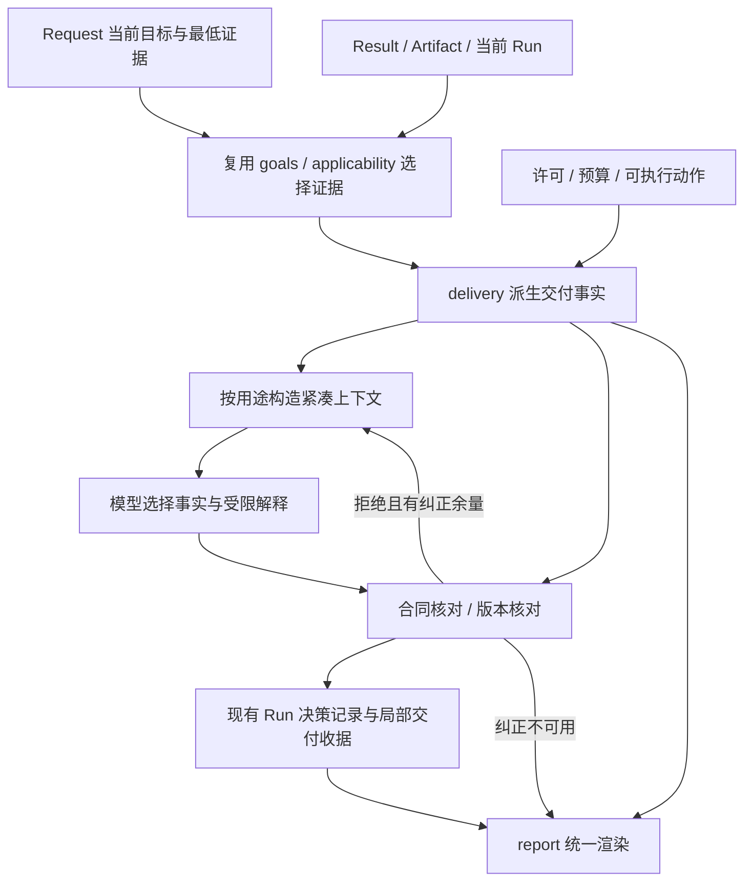

# BG6022-v4 最佳修复方案：从已知缺陷修复到完整验收

日期：2026-10-08（Asia/Hong_Kong）  
核实基线：`accbee8f1e03b5e846a2af6850c51a57583fb403`，本机 `E:\BG6022-V4` 与远端 `main` 一致  
当前提示：`agent-json-v21`；语义候选：`request-semantics-2`  
文档性质：基于源码核查、现有真实证据及本轮离线检查形成的实施方案；不是修复已完成的报告。

参考材料：[用户提供的根因与剩余缺口报告](E:/chrome/BG6022-v4_accbee8_Root_Cause_and_Remaining_Gaps.md)。文中的现状判断以本轮代码核实为准，设计字段、预算和验收指标均明确作为建议。

## 1. 推荐决策

**保留现有七对象、单一 Agent 循环、Tool 执行边界和 ORCA 科学检查链，集中修复“交付合同、终止上下文、预算预约与恢复”，随后完成当前版本的真实模型、真实输入获取、科学计算和正式重复验收。**

增加预算应服务于有依据的修复迭代和完整验证。最值得增加的是：当前候选的模型行为验证、真正从纯文本开始的端到端轨迹，以及正式冻结失败后重新验证的预留。单纯增加提示词或反复重跑原包，无法解决程序接受矛盾解释的问题。

我建议采用以下组合：

1. **程序拥有权威结论。** 模型提交受约束的解释结构；程序核对目标、事实引用、阻断和建议，再由现有报告路径渲染。
2. **按决策用途提供上下文。** 优先修复终止与澄清阶段，消除重复历史，保留全部必需目标与关键证据。
3. **提前保障最终交付。** 统一终止模式判定，同时保留调用、决策轮次、token 和必要时间余量。
4. **允许有限、多候选的持续修复。** 普通开发失败留证后进入下一轮修复；正式评测保持固定版本、完整矩阵和独立重复。
5. **以完整退出条件判断完成。** 离线全绿、单个 N06 通过或确定性报告能读，均不足以宣布阶段 B 完成。

推荐的完整修复周期累计预算上限为 **2,068 次模型 HTTP、13,882,912 tokens、USD 20、213 次 ORCA 启动**，其中包含第二轮正式冻结验证的条件预留。它是建议上限，不是预计实耗，也没有在本轮写入实际账本。详细分配和扩大预算的触发条件见第 9 节。

本次用户要求是输出最佳修复方案，因此本轮交付 Markdown 文件。附件中的“本轮不授权执行”“r4 待批准”等属于旧审查的上下文；本方案以用户现在允许提高预算、以修复完成为目标的要求为依据，同时保留历史运行事实和各 Run 的科学边界。

## 2. 当前事实与本轮补充发现

### 2.1 已核实的基础

| 项目 | 本轮确认的事实 | 对方案的影响 |
| --- | --- | --- |
| 版本 | 本机 HEAD 与远端 `main` 均为 `accbee8`；核查时 Git 工作区干净 | 可以直接对照附件，不存在用旧报告分析新代码的问题 |
| 产品主干 | `ask --text`、语义规范化、规划、输入获取 Tool、ORCA 执行、逐输出检查和报告均已存在 | 做局部闭环修复，无需重建 Planner |
| 最近真实失败 | r3/V06 的最终 JSON 完整返回，但把不足证据解释为目标证据充分，遗漏零追加预算 | 首要修复对象是解释的接受与交付一致性 |
| 当前提示 | v21 增加终止提示，尚无 v21 的新真实解释通过记录 | 提示修改只能作为修复的一部分 |
| 容量 | V06 的 v21 离线派生输入上界为 `11988/12000` | 必须做投影和容量合同，12 的余量不可作为可靠设计 |
| 现有全量记录 | 仓库记录为 2485 passed、193 skipped；不是本轮重跑结果 | 保留该证据，修复后再做候选自己的干净验证 |
| 本轮定向验证 | 4 个现有测试文件共 **132 passed，23.01 秒** | 说明所查路径目前回归通过；不证明真实模型缺陷已闭合 |

本轮运行的测试文件是 `test_context_terminal_outcome.py`、`test_bounded_protocol_delivery.py`、`test_report_extended.py`、`test_text_entry.py`。本轮没有执行真实模型、PubChem、OPI 几何生成或 ORCA，没有修改生产源码。[当前验证记录](https://github.com/az87988799/BG6022-v4/blob/accbee8f1e03b5e846a2af6850c51a57583fb403/docs/acceptance/bounded-gap-v21/report.md)

### 2.2 必须纠正的一个范围判断：Markdown 报告和模型 reason 是两条路径

当前 `cli.py` 的 `report` 和 `ask` 最终 Markdown 都调用 `build_report()` → `render_report()`，并没有把模型 `Proposal.reason` 直接拼成 Markdown 主结论。`ask` 会先输出整个 Run 的 JSON，因此错误 reason 仍可能出现在决策记录中；模型评测也把该 reason 作为最终解释。

因此，不能把现状写成“整个用户报告由模型错误正文生成”。正确的修复范围是：

- 保留确定性 Markdown 报告，补齐其关键判据数值、阈值、许可和零额度的表达。
- 为模型解释建立可验证的接受合同。
- 明确 Run 审计记录和已验证用户交付的区别，避免调用方把 `decisions[-1].reason` 当最终答案。
- 在 CLI 中明确标注审计输出；若调整默认输出或新增 `--json`/`--audit` 选项，单独处理已有脚本兼容性。

目前 `build_report()` 的预算部分有 limits/usage，但没有完整 permission 事实；有限采样正文主要呈现未通过和 reason。统一交付时应直接复用分析 Result 中的跨度、阈值及容差，把停止的实际原因写清楚。[CLI 输出路径](https://github.com/az87988799/BG6022-v4/blob/accbee8f1e03b5e846a2af6850c51a57583fb403/src/orca_agent/cli.py#L172-L185)、[报告构造与渲染](https://github.com/az87988799/BG6022-v4/blob/accbee8f1e03b5e846a2af6850c51a57583fb403/src/orca_agent/report.py#L148-L418)

### 2.3 新发现：未完成目标可能用不了最后一次终止解释机会

当前 `context.build_context()` 与 `model_usage.send_model()` 中的 `final_only` 判定，主要依赖“所有必需 Goal 已 satisfied”。`final_explanation_budget()` 对其余 `explain_results=True` 的状态仍要求留出一次未来最终调用。

本轮合成离线函数复现如下，未发送 HTTP：

| 相同预算条件 | Goal 未满足 | Goal 已满足 |
| --- | --- | --- |
| 模型调用上限/已用 | 8 / 7 | 8 / 7 |
| 工具及科学权限 | 无可用 Tool，禁止科学执行，ORCA 额度为 0 | 相同 |
| Context 动作 | `clarify`、`stop` | `stop` |
| 输入上界 | 4897 | 4297 |
| 预算判定 | 仍要求未来再留 1 次，抛出 `BudgetExceeded` | 可使用最后一次调用 |

这说明**“科学目标完成”被部分用来判断“当前是否为最终交付调用”**，两者应拆开。它是本轮新增的离线路径发现，不是 r3 历史失败的原因；修复时还需覆盖完整发送和恢复路径。[终止预算函数](https://github.com/az87988799/BG6022-v4/blob/accbee8f1e03b5e846a2af6850c51a57583fb403/src/orca_agent/model_usage.py#L54-L80)、[发送前预约](https://github.com/az87988799/BG6022-v4/blob/accbee8f1e03b5e846a2af6850c51a57583fb403/src/orca_agent/model_usage.py#L302-L350)

### 2.4 新发现：stop 的恢复语义需要在本次修复中明确

离线探针复现了：两个只读目标中完成一个后，模型接受 `stop`，Run 为 failed；随后显式 `resume=True`，程序执行剩余只读 Step，模型 HTTP 次数保持不变。

这**不能直接定性为越权漏洞**：现有 README 明确允许显式 resume 对账后推进。问题在于，“恢复已接受终止决定”和“用户要求重新开始决策”目前缺乏足够明确的区分；stop 的 decision 保存与最终 Run state 保存也分为两步。

本方案建议通过局部终止收据和恢复规则补齐：自动恢复重放已接受的决定，显式 resume 如需重新开展工作，则先重新检查当前证据、阻断、许可和余额，再进入正常决策。不能凭旧 ready Step 直接跳过新的终止判断，也不应把 Run 永久封死。[Agent 执行与决策](https://github.com/az87988799/BG6022-v4/blob/accbee8f1e03b5e846a2af6850c51a57583fb403/src/orca_agent/agent.py)

### 2.5 正式矩阵也需要同步

当前 `coverage.json` 映射的是 **70 个变体、210 个三次重复槽位**，其中 78 个离线槽、111 个真实模型槽、21 个联合变体槽；联合变体对应 18 条独立科学轨迹。它是覆盖映射，不是已通过证据，文件中的收集信息本身也有历史版本字段。

不能继续拿旧实施文档中的 174 槽作为当前正式总数。修复后应从实际 fixture、harness 和测试收集重新生成候选矩阵，再追加本方案的新端到端用例。[当前覆盖映射](https://github.com/az87988799/BG6022-v4/blob/accbee8f1e03b5e846a2af6850c51a57583fb403/docs/acceptance/phase-b/coverage.json)

## 3. 最终架构：一个事实来源、一个交付出口



这里的“交付事实”“交付收据”和“解释结构”均为现有对象中的局部类型或可重建投影，不建立第八种长期领域对象，也不引入新的工作流框架。

关键依赖关系保持为：科学 Tool 产生检查事实；`goals.py` 判定当前用途；`delivery.py` 组织事实；`context.py` 提供模型输入；`proposals.py` 验证解释合同；`agent.py` 协调；`report.py` 输出。不得在 Agent 中加入 `if tool == 'analysis.finite_sampling'` 之类科学分支。[项目蓝图](https://github.com/az87988799/BG6022-v4/blob/accbee8f1e03b5e846a2af6850c51a57583fb403/docs/ORCA-Agent-Project-Blueprint.md)

## 4. 修复一：把终止解释变成受约束的交付合同

### 4.1 扩展已有事实投影

以 `collect_goal_facts()` / `goal_fact_rows()` 为入口，复用 `current_goal_evidence()` 的证据选择及适用性判断。不要让 Context、报告和解释验证器各写一套“Goal 是否满足”的规则。

建议的局部投影至少表达：

| 字段含义 | 由谁提供 | 必须保持的约束 |
| --- | --- | --- |
| Goal 标识、必需性、原文依据 | Request | 全部必需 Goal 都存在，不因上下文缩减丢失 |
| 操作是否完成 | Result | completed 不等于目标完成 |
| 当前目标状态 | 现有目标验收 | 历史 qualified 不自动成为当前适用证据 |
| 判据结果 | Tool 已保存的分析事实 | 直接引用判据、数值、单位、阈值与容差，不让模型重算 |
| 科学输出与原始观察 | Result 中对应角色 | 未合格观察不升格为 qualified output |
| 成员状态 | 已绑定成员表 | required/optional、qualified/missing 各自保留 |
| 条件与条件来源 | 当前适用性检查 | unknown、用户指定、默认、继承不可混同 |
| 阻断集合 | 当前许可、预算、执行状态、缺项 | 可同时有多个原因，不能压成单一互斥 stop_reason |
| 可执行下一步 | 现有就绪与权限检查 | 模型不能通过建议扩权 |
| 证据引用 | 当前选中 Result/Artifact/规则 | 不引用未消费、失效或不属于当前用途的证据 |

给这些行建立当前上下文内的短引用，例如 `g1`、`f1`、`b1`；完整 ID、hash 和来源保留在程序映射及原始记录中。短引用不能跨请求版本复用。[现有事实投影](https://github.com/az87988799/BG6022-v4/blob/accbee8f1e03b5e846a2af6850c51a57583fb403/src/orca_agent/delivery.py)、[当前证据选择](https://github.com/az87988799/BG6022-v4/blob/accbee8f1e03b5e846a2af6850c51a57583fb403/src/orca_agent/goals.py)

### 4.2 V06 的事实必须明确分开

冻结用例的正确事实是：

- 有限采样分析操作已完成。
- 三个已采样成员能量合格；另有两个尚未绑定的可选采样成员。
- 邻点跨度为 `0.16000000000042536 Å`，大于 `0.12 Å + 1e-8 Å`。
- `span_too_wide` 已足以支持“不达标”的检查结论。
- 当前“取得达标采样证据”的 Goal 未满足，采样合格输出为空。
- 科学执行未授权、追加科学未授权，ORCA 与追加 ORCA 额度均为 0。

不要把两个可选成员未采样本身写成“缺少必需成员”；导致当前 Goal 失败的判据是跨度不达标。不要把“能够回答没有达标”变成“已经完成取得达标证据的目标”。

建议的权威正文应达到这样的表达：

> 已有三份单点能量均通过各自检查，但最近左右采样邻点的跨度约为 0.160000 Å，超过允许的 0.12000001 Å，因此当前采样目标尚未满足。当前未授权新增科学计算，追加 ORCA 额度也为 0，本次停止并保留已有结果。该判断只适用于已采样的离散几何，不能证明连续范围或全局最低点。

此段是目标输出示例，不是新模型已经生成的成功证据。[真实失败 fixture](https://github.com/az87988799/BG6022-v4/blob/accbee8f1e03b5e846a2af6850c51a57583fb403/tests/fixtures/phase_b/v06-terminal-outcome/input.json)

### 4.3 模型提交什么

建议给新 stop 协议增加版本化、类型化的解释参数。下列只是设计示意，最终字段由实现与测试共同冻结：

```json
{
  "delivery_contract": "terminal-delivery-1",
  "snapshot_ref": "current",
  "goal_explanations": [
    {
      "goal_ref": "g1",
      "fact_refs": ["f_members", "f_span", "f_goal"],
      "explanation_ref": "e_span_fails_current_goal",
      "blocker_refs": ["b_science_disabled", "b_orca_zero"],
      "next_action_ref": "n_stop_with_partial_results"
    }
  ]
}
```

程序根据当前事实生成可选解释关系、限制和后续动作，例如“此判据使本 Goal 未满足”。模型选择并组织这些解释，不填写任意成功布尔值、不填写数值、不自造来源或预算。`snapshot_ref` 由程序绑定至本次模型请求的实际快照，模型无需计算 hash。

下一步区分“当前可以执行的动作”与“满足明确前提后才可考虑的建议”。后者可说明需要新增许可、补充条件或证据，但只能使用程序列出的前提，不能被执行器当成已获许可的动作。

验证器应至少拒绝：

1. 漏掉必需目标、重复目标、引用未知目标。
2. 把其他目标的来源或过期事实用于当前目标。
3. 选择与当前事实不相容的解释关系。
4. 漏报必须披露的阻断，或把带前提的建议宣称为当前可以执行的动作。
5. 当前 Request、Plan、permission 或 control generation 已改变。
6. 解释结构超出声明 schema，或含未允许的主张字段。

**只有引用存在还不够。** 验证器还必须核对“目标—事实—解释关系—动作”的组合有效性，防止事实引用合法而推论仍错误。

关键数字、目标完成状态和强制限制始终由程序渲染。顶层 `Proposal.reason` 及历史 `parameters.reason` 可保留为审计信息，但不自动成为“已验证科学解释”。若未来保留自由补充文字，应单独标明未做机械语义保证，并接受独立评测；首轮默认主交付不引入这条自由正文路径。[现有 StopParameters](https://github.com/az87988799/BG6022-v4/blob/accbee8f1e03b5e846a2af6850c51a57583fb403/src/orca_agent/proposals.py#L14-L51)

### 4.4 拒绝、纠正与降级

- 冲突候选按现有 proposal rejection 路径拒绝，保存原响应和程序诊断。
- 纠正消息只提供短错误码、错误字段和当前合法事实引用，避免重新注入整段错误正文。
- 首轮继续使用现有 `corrections_per_proposal <= 1`；不先增加单提议纠正次数。
- 纠正调用必须同时满足 HTTP、token、决策轮次、时间和批次额度；不暗中重试，不退回已经发生的费用。
- 纠正仍失败或额度不足，输出确定性报告，同时记录模型解释失败或不可用。
- 要求模型解释的评测仍判失败或部分完成，不能因为报告自动补全正确事实就给模型记通过。

### 4.5 不把所有状态塞进 delivery_status

保留现有 Run 状态和 `delivery_status` 的兼容含义。新增局部交付记录时，分开记录：

| 维度 | 示例含义 |
| --- | --- |
| 科学目标 | 全部满足、部分满足、证据不足 |
| 登记/检查交付范围 | 仅登记完成、只读检查已回答、科学目标交付 |
| 模型解释 | 未请求、待生成、合同通过、拒绝、不可用 |
| 报告产物 | `pending / rendered / failed`，以及成功生成后的快照/版本/hash |

“合同通过”仅表示声明范围内的主张可机械核对，不命名为“任意科学推理均正确”。解释失败不能把原已合格能量改成不合格；科学失败也不能被登记完成掩盖。

## 5. 修复二：终止上下文与容量预约一起改

### 5.1 用统一的决策用途取代重复 final_only 推断

在现有函数中派生局部模式，至少区分规范化、规划/反馈、终止、澄清。这个模式不是新 Run 状态。

终止模式的依据应包括当前合法动作、必要执行是否结束以及本次是否只承担交付，不能以 Goal 全满足作为必要条件。统一结果传给 Context 构建、模型预约和合同验证，发送前仍在锁内复核当前 basis。

需要覆盖四条路径：

1. 所有必需 Goal 已满足后的正常交付。
2. Goal 未满足、没有合法可执行后续动作的部分交付。
3. 真正存在待答问题的澄清；不能拿 clarify 绕过解释或预算问题。
4. `registration_only` 等不经过 stop 就形成交付的路径。

### 5.2 终止上下文只保留决策必需内容

| 必须保留 | 可从终止模型输入移除或去重 |
| --- | --- |
| 全部必需 Goal、最低证据、适用条件、原文依据 | 已执行 Step 的完整参数 schema |
| 当前选中的证据及有意义的失败事实 | 无关历史 Result 和旧提议全文 |
| 数值、单位、阈值、容差及判据结论 | 同一事实在 Request、Result、goal_facts 中的多份副本 |
| 成员身份、required/optional 和缺项 | 反复出现的长 ID/hash，改为可解析短引用 |
| 许可、余额、执行未知状态和允许动作 | 当前无法调用的工具目录及规划指导 |
| 关键限制、真实待答问题 | 与当前语义无关的长历史消息 |

`agent.py` 当前会加载全部 `run.result_ids`；Context 对超过 32 个 Result 直接拒绝。应在进入 Context 前按当前目标绑定、当前反馈及必要来源依赖选择相关证据。不能简单取最后 N 个 Result，也不能以时间新旧替代当前用途选择。

完整原文与历史仍保存在原始记录中。任何可能改变目标、条件或许可的文本都必须保留其精确相关片段；不能用不可逆摘要或 hash 替代仍需理解的关键要求。若无法安全确定相关范围，按容量合同拒绝该模型输入。[Context 当前构造](https://github.com/az87988799/BG6022-v4/blob/accbee8f1e03b5e846a2af6850c51a57583fb403/src/orca_agent/context.py#L890-L960)

### 5.3 定义可检验的容量包络

当前通用 Request 的 Goal 数等字段并非都有全局上界，因此不能声称任意合法 Request 都能装进 12000。应声明本候选支持的模型交付包络，并在昂贵执行前做实际估算。

建议以项目现有保守估算器为准，首轮目标为：

- 标准终止回归，包括真实 V06 派生输入：上界不超过 **8000**。
- 声明支持的边界场景及一次纠正：上界不超过 **10000**。
- 单次输入硬限制保持 **12000**，completion 保持 **2000**；这些指标是建议验收目标，尚未测得。
- 超过支持包络时返回明确容量缺口及确定性交付；不能静默截掉必需 Goal、成员条件或阻断。
- 模型输出结构本身也做长度上界检查，避免目标数量过多导致 2000 completion 无法容纳。

容量测试必须包括：多目标、长 ID、中文长原文、多轮补充、多个条件来源、失败诊断、成员表、纠正诊断、临界剩余 token，以及大量无关历史。

其中一个重要性质是：**加入无关历史结果不应让终止输入无界增长；增加当前必需目标则必须保留其全部语义，超过包络时明确拒绝。**

### 5.4 给未来交付保留实际预算空间

现有最终调用预约保留，但增加可重算的交付余量。它是既有 Run 预算内的占用规划，不是已发送 HTTP，也不能提前记为实际 token。

```text
非终止动作允许启动的必要条件：
  已使用 + 未知占用 + 本次预约 + 必需最终交付余量 <= Run / 批次限额

终止调用允许启动的必要条件：
  已使用 + 未知占用 + 本次真实 PreparedRequest 预约 <= Run / 批次限额
```

在最终交付调用发生时，将预留转为实际预约，避免双算。已知 token 用实际结算，未知用量保持保守占用。

例如，若本容量包络的最终输入上界为 10000、输出为 2000，一次必需最终交付需要保留最多 12000 token 的空间；若还承诺一次纠正，则需另外保留该纠正的最大成本。若预算只够首轮，就明确不承诺纠正，失败后降级。该数字是预算计算示例，不能代替对真实序列化请求的检查。

同时检查未来调用次数、决策轮次和墙钟余量。在执行昂贵分析/科学动作前重新评估；新增证据使终止投影超包络时，不再启动后续昂贵动作。对“未完成目标的最后一个终止调用”增加完整路径测试，防止再次为不存在的未来回答留槽。[现有预约实现](https://github.com/az87988799/BG6022-v4/blob/accbee8f1e03b5e846a2af6850c51a57583fb403/src/orca_agent/model_usage.py)

### 5.5 何时再提高单 Run 限制

批次加钱不等于单 Run 获得更大的模型预算。当前 `BudgetLimits` 硬限制包括 8 次模型调用、48000 tokens、12 个决策轮次、1800 秒；仅修改批次账本不会改变这些限制。

先用紧凑投影验证纯文本完整链能否在现有上限内完成。若真实轨迹证明合法必要步骤仍容纳不下，再新增明确版本的局部预算 profile，并同步 `models.py`、配置、预约、harness 和测试；不得仅修改配置使其与 schema 冲突，也不得自动切换模型或 thinking 模式。[BudgetLimits](https://github.com/az87988799/BG6022-v4/blob/accbee8f1e03b5e846a2af6850c51a57583fb403/src/orca_agent/models.py#L331-L350)

## 6. 修复三：交付的持久化、恢复与兼容

在现有 Run 决策及文件存储中增加局部终止收据，至少绑定：decision ID、Request/Plan/permission/control 版本、选中事实摘要指纹、解释合同版本、核对结果及报告版本。指纹基于稳定事实，不包含每次读取都会变化的时间值。

还要区分**发送给模型的冻结决策快照**与**本次调用结算后的实际余额**。模型预约、结算会改变剩余调用和 token，不能让本次合法结算使自己的事实指纹失配。稳定指纹绑定目标、来源、规则与科学执行阻断；模型费用和余额由程序在结算后重新呈现，并保留其快照时点，不让模型预测最终余额。

接受终止的推荐顺序是：

1. 在当前 Run/control 锁下复核 basis、当前目标事实和必要来源。
2. 核对模型解释结构，形成一次 accepted decision 与交付记录。
3. 通过现有原子保存机制一起写入决策应用标记、Run 终止状态和局部交付状态；报告此时只记为 `pending`。
4. 报告由已保存快照重建；实际渲染及可选文件原子发布成功后才记录 `rendered` 和 hash，失败记为 `failed`。写文件使用稳定身份，重复渲染不创建新模型调用，也不改变已有科学事实或已通过的解释合同。

若多文件无法一次原子写入，先保存可幂等重放的收据，再补写派生报告；无需为此引入 outbox、数据库或事务框架。

故障注入覆盖：HTTP 回执已保存但未接受、验证完成未保存、决策已保存但报告未写、报告已写但 CLI 未返回、恢复期间用户补充消息，以及来源文件在交付前变化。

恢复时优先对账。没有新用户意图的重放使用原收据，不能重复扣费或发布新的事实版本；显式 resume 如需重开工作，保留原终止记录，在当前许可和余额内重新决策。旧 `reason`、旧检查版本和旧失败评分保持原字节，不批量迁移成新合同通过。

每次把历史收据作为“当前已验证交付”呈现前，仍须沿用现有读取时来源检查，复核所引用 Artifact/hash。来源变化时保留旧收据作为历史事实，当前报告标注 `source_unverified` 并抑制对应的已验证输出；不改写旧收据，也不自动重跑模型。稳定快照不能替代当前来源完整性检查。

新协议使用明确版本区分历史记录；新 schema 从同一类型定义生成。旧模型回执可读取、审计和重评分，不据此直接授权新执行。

## 7. 修复四：完整输入链与目标语义

### 7.1 真正的纯文本端到端验收

现有 r4 的结构准备由 harness 直接调用生产 Tool，之后科学轨迹从冻结 XYZ 开始。它可以保留为分层验收，但必须补充以下完整链：

```text
仅用户原文 + 显式本地 profile
→ 程序建立待规范化 Request
→ 模型规范化目标
→ 模型提出 structure.resolve
→ 真实身份查询及检查
→ 模型提出 structure.prepare
→ 真实 OPI/RDKit 准备与 Run 输入绑定
→ 模型形成科学 Plan
→ 真实 ORCA
→ 当前目标验收
→ 新解释合同与统一报告
```

正例固定为当前已声明科学范围：水严格优化并给出优化后的电子能；甲烷所准备几何的单点电子能。harness 可以启动 CLI、设置明确 profile、准备独立参考并收集证据，不能替模型选择 resolve、prepare 或预填科学 Goal/XYZ。

每个体系至少 3 次独立完整轨迹，每次重新获取/准备输入。每次的几何及 hash 独立冻结，参考计算与实际输入绑定。将这类“重新生成输入的完整链重复”与 r4 的“相同冻结 XYZ 上执行重复”分别报告。

`prepared_geometry` 只能作为初始输入。水优化必须提供末次优化阶段的合格结构，以及与该结构/阶段一致的电子能；不能用 prepared XYZ 或早期成功阶段填补目标。[纯文本入口](https://github.com/az87988799/BG6022-v4/blob/accbee8f1e03b5e846a2af6850c51a57583fb403/src/orca_agent/natural.py#L302-L328)、[输入绑定检查](https://github.com/az87988799/BG6022-v4/blob/accbee8f1e03b5e846a2af6850c51a57583fb403/src/orca_agent/input_bindings.py)、[现有 r4 范围](https://github.com/az87988799/BG6022-v4/blob/accbee8f1e03b5e846a2af6850c51a57583fb403/docs/reviews/2026-10-08-bounded-real-validation-r4.md)

### 7.2 “检查是否达标”和“取得达标证据”必须分开

对未来新请求，规范化时应识别用户要的是：

- **判据检查：** 检查给定证据是否达标。证据足以给出否定结论时，该检查任务可以完整交付。
- **取得目标：** 在许可与预算范围内补充工作，取得满足科学判据的证据。当前判据为否时，Goal 仍未完成。

这不能只靠添加一个 `intent` 字符串后让报告自行判通过。如果现有 Goal/Tool 合同无法表达第一类，应在现有分析 Tool 内增加明确的检查交付契约和版本化验收，复用同一科学判据；检查输出与合格 sampling 端口分开。

旧 V06 的 Request、目标、阈值和评分不改变。首个修复候选先闭合既有 Goal 语义，随后作为独立小补丁支持新请求的两类意图，避免在修 Bug 时扩大成通用自然语言推理框架。

同时补充多目标原文覆盖、同一消息给多个目标补绑、否定作用域、默认来源、未知身份和登记不执行的边界用例。

## 8. 验证顺序与完成门槛

### 8.1 离线行为回归

| 测试组 | 必须验证的行为 |
| --- | --- |
| V06 真实反例 | 三份成员合格但 Goal 未满足；错误完成主张无法通过新合同 |
| 正向完成 | 判据和条件全部适用时正常完成，避免把所有 stop 都改成失败 |
| 许可与额度 | 未授权和零额度同时披露；批次有余额不能覆盖 Run=0 |
| 仅检查为否 | 新检查任务可完整交付否定结论；不发布合格 sampling 输出 |
| 仅登记 | 登记完成与科学未完成分开；没有待答问题不进入 waiting_user |
| 多目标 | 结构与能量均为必需时不得漏掉其中一个；跨目标事实引用被拒绝 |
| 当前用途 | 历史合格但当前条件未知或不同，不能继承成当前已确认 |
| 原始观察 | 只读了部分文件时保持 partial；单位未知不能补成推测单位 |
| 协议纠正 | 首次错误保留；最多一次已预算纠正；耗尽可确定性交付 |
| 终止最后一槽 | Goal 未满足且合法进入终止时可用最后一次调用；不会重复保留未来槽 |
| 容量 | 多目标/多成员/长原文/纠正均满足包络或明确拒绝；无关历史不撑爆输入 |
| 恢复 | 终止收据幂等；不重复发送、不重扣费；显式重开重新检查阻断 |
| 版本变化 | 新用户消息、条件变化、来源变化使旧候选失效 |
| 输入链 | resolve/prepare 结果、用途、hash、电子态和 Request 版本绑定正确 |

真实失败 fixture 与合成正例标注来源。便携核心测试不依赖开发机 E 盘归档；原先缺历史档案而跳过的 49 项应分类为“必须便携的核心回归”与“需要外部档案的审计回放”，不靠删测试或模拟历史来清零跳过数。

### 8.2 真实验证分为五层

| 层次 | 执行范围 | 通过标准 |
| --- | --- | --- |
| A：固定事实的真实模型 | 原 13 个零 ORCA 门槛（含 N06、V06） | 不只 action/schema 通过，物理量、单位、条件、来源、限制、下一步均正确 |
| B：分层输入和科学 | 真实身份查询、准备、独立参考；水 Opt/甲烷 SP 各 3 次 | Tool 本身可用，来源可追溯，末次优化检查通过 |
| C：自主纯文本输入链 | 水、甲烷各 3 次完整新 Run | 同一 Run 中模型自主选择输入 Tool、规划科学计算并一致交付 |
| D：原阶段 B 剩余行为 | 原 C、条件 D、成功反馈追加/充分停止、有界修复/耗尽、查询导入与恢复 | 每种行为有对应当前版本证据，不能由新输入链代替 |
| E：正式冻结 | 当前 70 个变体各 3 次，共 210 覆盖槽；新 E2E 六条正式 Run 另计，最终以候选 manifest 为准 | 同一最终候选与环境，保留所有失败、首次/纠正后结果及成本 |

独立参考必须在评分前固定规则。对每次新 prepared XYZ，SP 参考绑定该几何；Opt 使用明确的终态、原子映射和容差，不宣称任意初始结构都必然到同一最低点。同 ORCA 引擎、独立输入与读取属于工程交叉核验，不构成跨引擎或实验精度保证。

### 8.3 不用确定性报告掩盖模型失败

每条真实记录至少分列：

- 首次模型候选是否正确、合同是否接受。
- 纠正次数、纠正后是否成功。
- 程序科学检查与当前 Goal 状态。
- 最终用户交付是否一致、完整。
- 自由 reason 如保留，其独立事实/语义评分。
- 实际 HTTP、已知/未知 tokens、费用、ORCA、查询、准备和时间。

对于新受约束解释方案，明确写出评测协议变化，继续使用原 V06 的证据、目标和严格语义要求。历史错误原文不改为通过。若只证明了渲染器正确，就只声明渲染器正确；不能声称模型自由解释能力已提高。

同步修改 `phase_b_model_cases.py` 的最终响应接受断言，使其核对新终止收据与事实绑定，不能仍只检查 accepted stop 和 Run 状态。`phase_b_grading.py` 对原模型 reason 与保存决定的一致性检查继续保留；程序不得重写 reason 后伪称模型原答正确。

3 次独立重复是工程验收下限，不能推导成高置信度的通用成功率。报告分母、失败及适用范围，不写“永久杜绝任何科学幻觉”。

## 9. 预算：一次规划完整修复周期，按证据分段消耗

### 9.1 现有账本基线

本轮只读核对 `data/phase-b/batch-ledger.json`，SHA256：

```text
b5b0efbfb7b8a805a904b08fbf3d35e7a325809c897bab3c7c68ede2ae039b13
```

| 维度 | 累计已用 | 当前已批准上限 |
| --- | ---: | ---: |
| 模型 HTTP | 324 | 1121 |
| 模型 tokens | 1,018,912 | 6,893,807 |
| 模型费用 USD | 0.4065609 | 10 |
| ORCA reference | 16 | 17 |
| ORCA development | 26 | 54 |
| ORCA formal | 0 | 48 |
| ORCA 合计 | 42 | 119 |

这些费用来自项目账本和冻结计价方式，不是本轮向供应商查询的账单。未知占用为零是当前账本事实，后续未知成本仍应保守占用。

### 9.2 推荐新增分配

以下从当前已用之后计算。各项是独立用途的最大预留，不能把未用正式槽位借给开发试跑。`ref/dev/formal` 均表示 ORCA 启动次数。

| 用途 | HTTP | tokens | ORCA 分配 | 身份查询 / 准备 |
| --- | ---: | ---: | --- | ---: |
| 13 个零 ORCA 门槛，最多 3 个开发候选 | 192 | 1,536,000 | 0 | 0 / 0 |
| r4 分层科学部分，6 条轨迹 | 48 | 288,000 | 1 ref + 6 dev | 2 / 2 |
| 原 C 专用预留 | 48 | 288,000 | 16 dev | 0 / 0 |
| 条件 D 专用预留 | 16 | 96,000 | 6 dev | 0 / 0 |
| 新自主 E2E 开发，水/甲烷各 3 条 | 48 | 288,000 | 6 ref + 6 dev | 6 / 6 |
| 有实际修复后的定向储备 | 48 | 384,000 | 2 ref + 8 dev | 2 / 2 |
| 第一轮原正式矩阵 | 624 | 4,704,000 | 48 formal | 0 / 0 |
| 第一轮新自主 E2E 正式验证 | 48 | 288,000 | 6 ref + 6 formal | 6 / 6 |
| 第二轮原正式矩阵，条件预留 | 624 | 4,704,000 | 48 formal | 0 / 0 |
| 第二轮新自主 E2E，条件预留 | 48 | 288,000 | 6 ref + 6 formal | 6 / 6 |
| **新增消费空间合计** | **1,744** | **12,864,000** | **21 ref + 42 dev + 108 formal = 171** | **22 / 22** |

说明：

- 13 个门槛每候选沿用现有 `64 HTTP / 512000 tokens` 额度；增加的是候选轮次，不放松科学阈值。
- E2E 每 Run 先按 8 HTTP / 48000 tokens、一次科学启动测算；如完整合法轨迹实际需要更大局部预算，按第 5.5 节修改后重新汇总。
- 定向储备必须绑定已定位根因、实际补丁和对应反例；不是失败后原样再抽一次模型输出的额度。
- 新生成输入的参考独立计数，不借旧参考冒充该输入的核验。
- 第二正式轮只在第一轮失败且完成修复后启用。第一轮已通过时无需消耗第二轮预算。
- 当前正式矩阵额度沿现有方案；如果新增语义用例使原矩阵扩大，需从实际 manifest 重新计算，不能硬套旧 624 次。

### 9.3 累计上限与增量

| 维度 | 第一轮正式验收主路径累计上限 | 含第二正式轮的推荐完整上限 | 比当前已批准增加 |
| --- | ---: | ---: | ---: |
| 模型 HTTP | 1,396 | **2,068** | **947** |
| 模型 tokens | 8,890,912 | **13,882,912** | **6,989,105** |
| 模型 USD | 统一受 USD 20 总限额约束 | **20** | **10** |
| ORCA reference | 31 | **37** | **20** |
| ORCA development | 68 | **68** | **14** |
| ORCA formal | 54 | **108** | **60** |
| ORCA 总计 | 153 | **213** | **94** |

USD 20 是建议的独立费用硬限制，不是固定报价。执行前冻结实际模型及价格，校验上述分配在每次保守预约下仍可接受；任何一个维度先触顶都停止该受限调用。汇总 token 上限也不意味着可以任意调换输入/输出构成。

继续保持当前本地资源边界：4 核、总计算内存 1024 MiB、ORCA MaxCore 每进程 192 MB、整个环境最多一个准备或科学进程。沿用分层包的准备 30 秒、参考 120 秒、科学默认 300 秒、单 Run 最多 1800 秒；不因增加总预算而扩大并发。

身份查询与准备的新总额度各为 22 次；对应 E2E/分层 Run 各一次，不设置隐式重试。查询的响应大小、节流和连接/读写期限继续使用现有有界合同，失败和未知状态先对账。[r4 当前分配与资源参数](https://github.com/az87988799/BG6022-v4/blob/accbee8f1e03b5e846a2af6850c51a57583fb403/docs/reviews/2026-10-08-bounded-real-validation-r4.md)

建议另设本修复周期新增执行活动时间上限 **96 小时**，属于开发/验收管理层的时间预算，不是连续运行承诺或预计工期。它只统计实际执行活动，离线开发及等待另列；保留所有 Run 原 deadline，恢复不得重置。先用预检和真实实耗校准这一上限，不能仅以 USD 未耗尽为由无限延长计算。

### 9.4 开发失败和正式失败采用不同处理方式

**开发阶段：** 普通解释或结构失败关闭当条 Run 并保留证据。同一冻结候选中、与该缺陷无共享依赖的零 ORCA 门槛可继续用于诊断；涉及该缺陷的科学轨迹不启动。完成离线修复、反例回归和新提交冻结后，进入预分配的下一候选，不必为每一次普通失败重新设计整个续验包。

**必须立即停止关联执行：** 来源 hash 冲突、未知 HTTP 成本、未知进程状态、执行越权、资源超限，或共享科学/交付门禁失效。先完成对账和根因修复。

**正式阶段：** 任一必需门槛失败，该轮不能通过。修复后启用第二轮冻结，完整重验当前矩阵；不能把第一轮不同版本的通过结果拼入第二轮。

旧 r1/r2/r3 的执行机会继续关闭，新策略记录在新的修复周期 scope 中，不回写旧失败约定。仍使用原累计账本；换候选、换 Run 或更换标签不重置成本。

“直至修复完成”应解释为持续依据缺陷和证据推进，不以预算用完或测试暂时过关作为完成。若上述预留仍不足，下一步是提交新的根因、受影响范围和有限增量测算，沿同一账本扩展修复周期；没有进展的相同失败不得无限重跑。预算不能数学保证任务必然完成。

## 10. 实施拆分与依赖顺序

| 补丁 | 主要位置 | 交付内容 | 退出条件 |
| --- | --- | --- | --- |
| P0：冻结事实与决策记录 | `docs/decisions/`、fixtures、当前索引 | 记录解释权威边界、恢复语义、预算周期；保全 V06 原失败 | 明确新协议、兼容范围及评测口径，历史未改 |
| P1：统一事实与报告 | `delivery.py`、`goals.py`、`report.py` | 判据事实、并列阻断、逐 Goal 事实；补报告数字/额度/许可 | 正反例、登记和原始观察均准确 |
| P2：解释合同与幂等终止 | `proposals.py`、`models.py`、`agent.py`、现有 Store | 结构化解释核对、受控纠正、局部收据、恢复规则 | 错误主张不能发布为已核验交付；故障恢复不重复消费 |
| P3：终止投影与预算保障 | `context.py`、`model_usage.py`、Agent 证据选择 | 统一用途、紧凑事实、容量包络、最终余量；修最后一槽 | 标准/边界指标达标，超限明确拒绝，无关历史不影响容量 |
| P4：目标意图与完整入口 | `semantic.py`、`natural.py`、现有分析/输入 Tool、测试 | 新检查语义、目标覆盖及纯文本 E2E 用例 | 不改旧 Goal；输入链来源和终态绑定正确 |
| P5：验证与预算工具 | 现有 `phase_b_bounded_package` / evaluation helpers | 版本化新 scope、多候选配额、E2E 独立槽、生成矩阵 | 旧包关闭、额度不重置，所有入口同一守卫 |
| P6：真实验证与收尾 | 现有 acceptance 目录和索引 | 分层验证、原剩余场景、正式重复、真实成本 | 第 11 节全部条件有对应证据 |

P1 与测试 fixture 整理可并行；P2/P3 共享事实合同，应在接口确定后并行实现、联合验收。P4 的新意图语义可独立开展，但首轮 V06 修复无需等待该扩展。P5 的付费执行必须基于最终已验证的候选实现，不能边改 schema 边混跑正式槽位。

每个补丁先做相关定向测试；P1–P5 整合后进行干净 Windows 检出、锁文件安装/校验和完整离线回归，再冻结真实候选。复用旧 `.venv` 的验证与从锁文件新建环境的验证分开记录。提交记录、代码 hash、依赖、规则、prompt、profile、配置、二进制和预算快照都纳入候选身份。

## 11. 什么情况下才算修复完成

- [ ] 新合同下，V06 错误完成主张不能被接受为已验证交付；当前候选的真实模型解释满足全部语义要求。
- [ ] 正向完成、部分完成、仅登记、只读否定检查和缺条件正确区分。
- [ ] 数值、单位、阈值、来源、条件及多个实际阻断在主交付中完整呈现。
- [ ] 标准与声明支持的边界上下文满足容量合同；未满足目标的最后终止槽可用；无静默截断。
- [ ] 解释失败可确定性交付，且不会冒充模型解释通过或改变已有科学资格。
- [ ] 终止接受、崩溃恢复、显式重开与用户修订有完整回归，不重复预约、计算或发布。
- [ ] 新真实身份查询、OPI 准备、末次优化检查及独立参考均完成。
- [ ] 水/甲烷各至少 3 次真实自主纯文本完整链通过，证据中没有 harness 代选中间动作。
- [ ] 原阶段 B 的成功反馈追加、充分停止、真实修复成功、修复耗尽、查询/导入/分析/恢复均有当前候选证据。
- [ ] 最终冻结下的完整正式矩阵和新 E2E 重复通过；不存在跨候选拼接成功。
- [ ] 核心回归可在干净检出执行；剩余 skipped 有准确分类与理由，不把 skipped 记为 passed。
- [ ] 当前状态索引只指向一个最新完整检查点；旧失败、首次响应、纠正、未验证项和累计成本全部可追溯。

上述条件完成后，可以报告“本方案范围内的修复与验证完成，提交用户验收”。用户验收通过后再更新阶段 B 状态。支持范围仍以已验证的 H₂O/CH₄、中性单重态、RHF/STO-3G、单点及严格无约束优化为准；更广分子、DFT、频率、全局最低点及远程执行不因本次修复自动获得支持。

## 12. 本方案相对参考报告的主要增强

1. 将“模型解释错误”定位到真实接受与输出路径，保留已有确定性报告，并补其判据和停止因果。
2. 新增最后一次终止调用被错误保留逻辑阻断的离线发现，与真实 V06 根因分开处理。
3. 将终止合同、当前事实快照、持久化和恢复一起设计，避免只验证一次响应而忽略后续重放。
4. 给上下文提出可测容量目标，并覆盖无界 Goal 输入、输出长度和未来交付 token 余量。
5. 为自主纯文本链单独配置开发、正式重复和逐输入参考，补齐 r4 范围缺口。
6. 把预算从“失败一次续批一次小包”改为明确上限、多候选迭代、正式重验预留的完整修复周期。
7. 采用当前 210 槽覆盖映射作为复核起点，要求从最终候选重新生成完整矩阵。

**优先落地 P1–P3：统一交付事实、受约束解释、终止容量与预算。它们直接切断已确认的失败路径，也是后续真实验证预算最有价值的投入点。**
