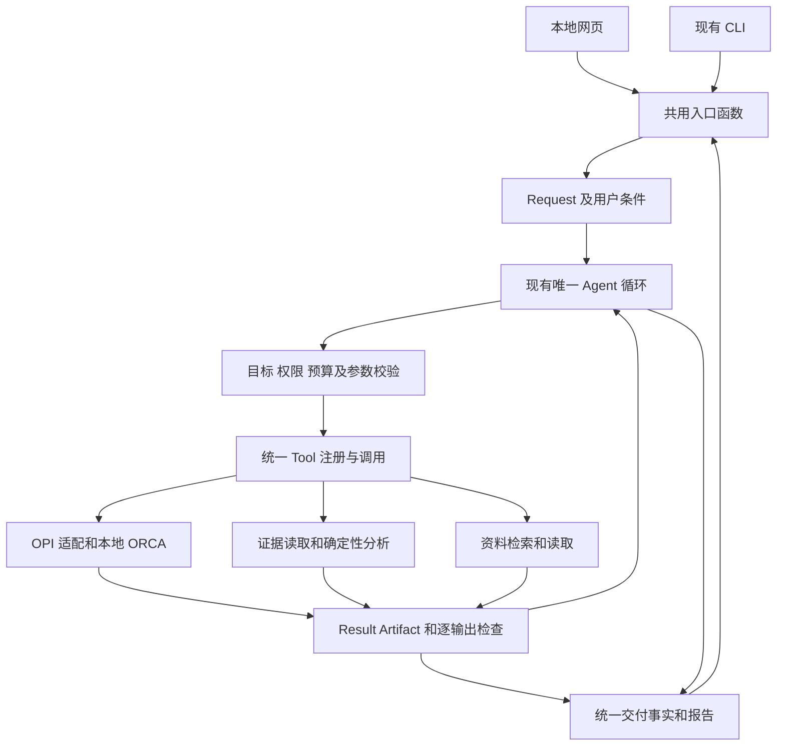

# 本地网页化学计算 Agent 实施方案

日期：2026-10-08（Asia/Hong_Kong）

核查源码：`2ce81ba21d162f440a6bba32ebf6f02ff8d69103`，当前分支 `main`

状态：实施提案，等待用户验收；本次只交付方案，不恢复暂停任务、不启动真实模型或 ORCA。

上位契约：[唯一现行总蓝图](../ORCA-Agent-Project-Blueprint.md)。本文细化本地产品实施范围，不替代总蓝图，也不把路线图整体视为一次性执行许可。

## 产品目标和本次范围

在现有项目中建设面向小分子学习与探索的网页助手。用户通过自然语言提出计算、结果查询或化学知识问题；明确条件优先，未指定部分采用可追溯的允许默认，关键歧义才澄清。计算在本机运行，模型使用现有 DeepSeek 接入。后续加入结构文件和 ORCA 输入文件上传。

长期目标是覆盖多数常见 ORCA 小分子请求。水优化、优化后偶极矩和正己烷构象是代表用例，不是产品功能白名单。第一交付先证明完整流程，后续按能力族增加经过验证的组合；未验证能力如实说明，不能靠放开任意关键词宣称通用。

本次方案包含代码调整范围、实现顺序、旧任务处置、网页生命周期、科学输出和准确查询验收。方案交付不改变既有运行许可、预算、验收结论或暂停状态。

## 当前代码基线

| 部分 | 已有事实 | 本次设计结论 |
| --- | --- | --- |
| ORCA 执行底座 | Windows Job Object、全环境计算额度、独立尝试、取消和恢复已有代码及阶段 A 历史真实验收 | 保留生产责任链，相关变更仍需回归 |
| 模型反馈 | 已有 DeepSeek 传输、调用计量、唯一反馈循环、终止交付合同 | 保留主循环，简化模型需要自行组装的协议 |
| 准确读取 | 已有 Artifact hash、JSON key/index/slice、发现、文本检索和范围限制 | 保留 reader，补齐自然语言到计算、结构、字段的可靠绑定 |
| 科学范围 | 参数、身份准备、输入构造及检查目前限制为水/甲烷、RHF/STO-3G、中性单重态、SP/严格 Opt | 扩展涉及多处契约，不能仅改一个工具枚举 |
| 偶极矩 | 有原始字段查询场景，尚无合格偶极矩科学输出端口 | 单独增加性质契约、读取和检查，区分观察与合格性质 |
| 网页及知识问答 | 当前是 CLI；无网页框架、完整普通知识回答合同或联网检索 Tool | 增加薄入口和必要局部合同，共用已有计量及工具边界 |

依据：[阶段 A 用户验收](../acceptance/phase-a/user-acceptance.md)、[阶段 B 当前状态](../acceptance/phase-b/implementation-status.md)、[第三开发候选失败记录](../acceptance/repair-cycle-development-3/report.md)、[查询调用修补决定](../decisions/0023-grounded-query-call-choices.md)。旧候选全量离线结果不代表当前 HEAD 的全量或真实验收已完成。

本次检查还发现未跟踪的 `docs/acceptance/repair-cycle-development-4/`，其中 N06 局部记录标为通过。这些文件属于暂停现场，本次不改写、不代为提交；没有重新核验全部原始 hash、账本及候选轨迹，因此不据此更新整轮状态或累计费用。

## 保留的架构和需要整理的代码

长期领域对象仍为 Request、Plan、Step、Tool、Run、Result、Artifact。网页和 CLI 共用业务入口，一个 Run 只有一个协调者；科学执行、查询及分析仍走唯一 Tool 定义和相应生产实现。

普通化学问答可以没有科学 Plan；不为知识解释伪造 ORCA 步骤。模型调用仍有 Run 内记录和有限预算。会话只是消息与 Run 引用的索引，不新增 Session 生命周期或另一个知识 Agent。

| 现有文件 | 具体调整 |
| --- | --- |
| `cli.py`、`natural.py`、`runner.py` | 抽出创建、消息、状态、控制、显式恢复、报告的共用函数；CLI 参数及已有脚本行为保持兼容 |
| `agent.py`、`proposals.py`、`decision_purpose.py` | 保留反馈循环；按当前用途约束可选动作和调用形状，重试仍有界；主循环不加具体科学工具名分支 |
| `context.py` | 分离 schema 投影、事实投影与传输编码；保留 `build_context` 和容量检查入口；减少重复材料，保留用户目标、限制及来源 |
| `semantic.py`、`natural.py` | 消除对 `context._schema` 等私有展示函数的依赖；提取文本依据和条件来源的纯函数；科学适用范围改由工具契约提供 |
| `tools/evidence.py`、`goals.py`、`applicability.py` | 统一查询范围绑定、证据覆盖和当前用途校验；保留原始查询的开放性与科学资格边界 |
| `delivery.py`、`terminal.py`、`report.py` | 保留同一交付快照与终止校验；网页显示已接受交付，不能把最后一条模型 reason 当可信报告 |
| `models.py`、`minimum_evidence.py`、`tools/registry.py`、`orca/adapter.py`、`orca/checks.py`、`tools/calculation.py` | 同步扩展方法配置、性质端口、来源和检查规则；旧结果不自动获得新版资格 |
| `store.py`、`model_usage.py` | 保留预算、锁和证据；补消息去重与会话索引；处理长期追问，不能通过换 Run、刷新或清空消息重置旧任务成本 |

新增文件只在实际实现相应职责时创建：共用入口可为 `entrypoints.py`，网页为 `web.py` 和静态资源；上下文整理可提取 `schema_projection.py`、`context_facts.py`，仅当存在实际压缩收益时提取 `context_encoding.py`。不预建空骨架，不增加 Service/Repository 分层、数据库或任务队列。

每一职责在现有入口内逐步替换。历史协议只用于兼容读取、回放和按原冻结条件对账，不形成两套可选的生产 Agent、ORCA parser 或 runner。

## 准确查询的执行合同

查询正确性拆为三项分别验收：找对数据、读对内容、解释不越过证据。底层成功读出 JSON 不能代替完整自然语言查询通过。

1. **锁定查询对象。** 从用户原文及会话引用绑定 Run、Result、尝试、结构或迭代范围。指代有唯一可信对象时自动沿用；存在多个会改变答案的对象时澄清。禁止默认取目录中最新文件。
2. **按目标选择读取方式。** 已注册性质先找适用于该目标的合格输出。原始字段先发现文件、键或数组结构，再使用实际返回的 typed path 读取；文本查找使用现有 search/text。模型不能猜索引、单位或未读到的段落。
3. **保留证据定位。** 回答中的数据带 Artifact、hash、原文件路径片段或行号、结构/阶段及检查状态。结构化视图路径和原文件定位分别标注。
4. **数值由程序呈现。** 单位换算、模长、差值等经有定义的确定性函数或分析 Tool 产生，记录输入和转换依据。缺少单位则返回未知，不能从“看起来合理”推断单位。
5. **分清事实和科学结论。** “文件写了什么”可以用未验证观察回答；“优化后的偶极矩”必须绑定合格优化结构及该性质检查。失败尝试中的最后一帧不能冒充优化结构。
6. **完整性有边界。** 分页、截断、部分文件、不同尝试、缺字段、源文件变化、来源冲突分别说明。请求“所有迭代”时必须验证覆盖范围，不能用第一页作全部结果。
7. **查询不隐式执行。** 查询缺少性质或 JSON 时只报告缺项。补算、转换或其他产生科学产物的操作需要显式 Step、影响和现有许可，不以查询调用暗中启动。

常用提问至少覆盖：“最终能量是多少”“偶极矩是多少，单位是什么”“这是哪个结构的结果”“第一次失败在哪里”“第三次迭代的数据”“原文件在哪一行”“和上一份结果能比较吗”。未注册字段继续可发现，不要求每个 ORCA 字段先写专用解析器。

协议调整先使用现有 v25 工作：真实工具名称枚举、就绪 Step 引用和可复制的调用形状。新方案不预设再造一种压缩语言或更换 DeepSeek 模型。模型只提交必要选择；程序派生的效果、执行身份及版本由程序绑定并重新校验。减少字段复述不能降低终止交付的目标覆盖、事实与来源检查。

## 首个科学扩展及后续覆盖

### 水优化和优化后偶极矩

新增局部 `dipole_moment` 输出定义，保存向量、模长、单位、坐标系及适用的原点约定、对应结构、方法/电子态、原始定位与检查版本。它可以由已有电子结构 Tool 声明产生，不必仅为一个字段增加一套执行器。

OPI 适配器负责输入和产物读取，检查器负责有限数值、单位、SCF 与运行状态、条件一致性及结构阶段绑定。请求“优化后”还必须通过优化结构谱系检查。不能从最后出现的一段偶极矩直接推断它属于最终合格结构。

首选消费优化产物中能确证属于最终结构的性质；若当前适配不能提供足够证据，由 Plan 明确安排合格优化结构上的性质单点，并在启动前核对预算。计算请求可以据此自主组合；完成后的纯查询不能自动补算。

ORCA 的电性质配置可参考官方 [Electrical Properties](https://www.faccts.de/docs/orca/6.1/manual/contents/spectroscopyproperties/electric.html)。具体 OPI 映射、文件字段、独立参考和误差容限在实现前冻结，不凭手册中存在一个关键词就宣布性质合格。

先可沿用已锁定配置验证工程链路；RHF/STO-3G 不能据此成为所有小分子探索的通用科学默认。面向探索的 DFT 默认在下一批根据体系、目标、可用资源和真实验证选择。用户明确方法超出已启用范围时报告限制，不静默换方法。

### 能力扩展顺序

| 次序 | 能力范围 | 增加的最低证据 |
| --- | --- | --- |
| 第一组 | 受控小分子身份与结构、更多方法/基组/溶剂、SP/Opt、偶极矩等基础电子性质 | 身份与结构一致、方法组合合法、收敛、逐性质来源与单位、目标适用性 |
| 第二组 | 频率、极小值检查、零点能及热化学 | Hessian 和结构绑定、振动模式、温度及标准态、热化学定义 |
| 第三组 | 构象候选、去重、排名及有界自适应搜索 | 候选集合与失败成员、探索范围、比较条件、停止规则及内部计算成本 |
| 第四组 | 指定端点的扫描、TS/NEB/IRC 和转化能垒 | 路径、驻点和连接关系分别检查，参照能量与端点明确 |
| 后续组 | TDDFT/UV–Vis、NMR、其他响应性质及需要时的开壳层/更高方法 | 按蓝图第 9 节逐能力建立输出、条件与反例 |

正己烷先获得候选集合内的构象排名，再按用户目标确定转化端点和路径；不能把扫描峰值或搜索到的最低值分别当作已验证过渡态或全局最低证明。

覆盖评测逐步扩展到蓝图第 1.3 节的 30–50 个代表请求，并保留未参与开发的请求。分别报告输入构造、执行、解析、检查、目标完成和修复，不把工具数量或少量样例通过率表述为支持大多数功能。

4 核、1024 MiB 总提交内存、MaxCore 192 MB/进程、全环境最多一个计算任务继续生效。此资源范围不能预先保证所有后续能力可运行；超限用例先说明，不自动提高上限。

## 本地网页和知识问答

### 页面和接口

首版页面包括聊天区、澄清输入、当前计算条件及默认来源、实际步骤状态、暂停/取消/继续、结果表、证据展开和文件下载。进度只显示已知状态或实际迭代，不编造总体百分比。上传文件、多人账号、远程集群暂不属于首批。

建议薄 Python Web 层配静态 HTML/CSS/JavaScript，首版用有界轮询，减少单独前端构建链。Web 框架候选为 FastAPI，依赖版本与许可证在实施时验证并锁入 `uv.lock`；其 [lifespan 接口](https://fastapi.tiangolo.com/advanced/events/)可以承载启动与退出处理，但进程清理、单协调者和恢复保证仍由本项目实现与测试。

| 接口职责 | 现有入口与约束 |
| --- | --- |
| 提交自然语言 | `natural.initialize_text` 经共用入口创建并返回持久 Run ID；提交去重先于启动 |
| 后续消息及澄清 | `Store.enqueue_message`；消息 ID 和处理状态持久保存，重发不重复消费 |
| 状态和报告 | `Store.load_run`、`report.build_report` 的受控投影；GET 不推进 Agent |
| 暂停和取消 | `Store.signal`；区分已收到请求和实际处理完成 |
| 显式继续 | 先核对当前目标、许可、预算与进程状态，再走 `runner.execute(..., resume=True)` |
| 证据和下载 | 仅收 Artifact ID、范围及合法路径段，复用证据读取与 hash 检查；不接受任意磁盘路径 |

默认仅监听本机回环地址、同源访问；写操作有来源校验和本地访问令牌，下载在授权 Artifact 范围内。模型密钥留在后端，不进入页面、下载、日志或计算子进程。模型/资料文本按数据渲染，不能执行其中 HTML 或脚本。这些是本地执行接口的必要边界，不引入多人权限平台。

### 网页协调者生命周期的待采纳调整

现行蓝图第 10.3 节明确首版为前台 CLI 协调者。网页要求需要更新这项具体契约；在实施前先记入 `docs/decisions/`，并同步唯一总蓝图第 10.3、12、14 节及相应测试。本文提出以下选项供随整体方案采纳，不把它写成当前已许可或已实现行为：

- 用户显式启动一个前台本地 Web 服务进程；首版单 Web worker，内部受管理地调用既有执行循环，HTTP 请求不阻塞等待整次计算。
- 浏览器刷新、关闭或连接断开不会产生新的协调者或重复启动；前台服务仍存活时，已启动的 Run 可在原许可和预算内继续。此行为需专门验收。
- 服务正常退出时停止新动作，按既有暂停语义在原期限内完成当前受管任务并收集；退出等待有界。立即退出使用显式取消并确认清理；异常退出仍依赖 Windows Job 的系统级清理，未知状态保守占用额度。
- 服务重启只展示已有事实；不会自动恢复暂停、失败或未知 Run。用户明确继续后才对账并推进。
- 首版不增加系统服务、自启动、脱离前台的守护进程、跨机器队列或崩溃后继续计算承诺。CLI 与网页竞争同一个 Run 时仍由现有锁拒绝第二协调者。

### 追问与知识回答

会话文件只索引消息顺序、Run 和证据引用。当前 `enqueue_message` 有累计 24 条上限，需要改为有界待处理队列/上下文与保留历史索引，定义存储和分页上限；不能简单清空历史或换 Run 获得新的重试额度。

对已完成计算的追问优先沿同一 Run 保留用量，允许只读动作。若使用蓝图允许的独立轻量查询 Run，绑定原始证据及查询预算，不复活或转移原科学任务额度。原目标的继续、修复和补算必须回到原预算与授权关系。新的独立目标可建新 Run，但必须明确是新用户请求，不把重试包装成新任务。

普通知识回答增加非科学交付目标和局部响应合同，可无 Plan，通过现有 `llm.py` 与 `model_usage.py` 记账。当前 Request 必需 Goal 和模型 Proposal 不能直接接一段自由文本就复用；需要同步语义、目标状态及交付合同，明确“回答已交付”不等于“科学验证通过”。不建立第二个决策循环。

基础概念直接回答。需要文献依据、ORCA 版本细节或最新信息时，通过统一注册的检索/读取 Tool 获得资料，保存 URL、标题、发布日期（若有）、访问时间和有界摘录。优先版本化 ORCA/OPI 文档及原始论文。结果解释必须区分本次计算证据与外部知识来源，检索失败或证据不足不编造引用。

现有项目无搜索后端。实施知识批次时先选定一个有明确访问方式、许可、网络范围和成本上限的检索适配并完成真实验证，不假定 DeepSeek API 自带联网；若无法完成，首版对应功能必须明确标记未完成，不能仅实现模型直答就验收整项知识能力。

## 分批实施和退出条件

| 批次 | 范围及主要产物 | 退出条件 |
| --- | --- | --- |
| 1 基线及契约 | 暂停现场只读清单、旧任务/门槛映射、查询验收集、网页生命周期决定、最小接口和 schema 变更设计 | 基线与未完成项可核查；历史文件和预算不变；本批不新增付费或科学执行 |
| 2 协议及准确查询 | 整理 context/semantic/proposals；完善对象、路径、范围和交付绑定；保留 v25 有效修补 | 旧失败反例和新的查询矩阵离线通过；有界真实模型验证完整查询，不以 JSON 合法代替语义正确 |
| 3 网页入口及对话 | 共用入口、前台 Web、会话索引、消息去重、连续追问、控制及文件展示 | 网页与 CLI 的事实一致；刷新/双客户端/退出/恢复不重复执行；知识与计算意图正确区分 |
| 4 偶极矩及知识链 | 水优化后偶极矩科学合同；基础知识回答和按需检索；确定性数值、来源与解释展示 | 各自离线及真实分层证据通过；模型解释失败仍保留真实结果；纯查询无科学启动 |
| 5 首个完整版本验收 | 网页自然语言到真实计算和连续查询；补齐蓝图第 13.3 节适用门槛及正式重复 | 完整流程、成功反馈再规划、有界失败修复、停止和部分交付均有证据；报告成本、失败和未验证项 |
| 6 常用计算覆盖 | 按前述能力组扩展分子、方法和性质，逐步形成保留测试集 | 每族独立正反例、解析和检查、组合用例及真实证据通过；更新能力矩阵后才启用自主执行 |

批次 3 的只读页面可在批次 2 后半开发；批次 4 的确定性性质读取可与页面开发交错进行。科学启动仍串行且全环境只有一个槽。每批保持可独立审查、提交及回退；不把所有工作合成一次大改。

水优化和偶极矩是第一条新增用户验收链，并不取代蓝图第 13.3 节的其他要求。网页暂不提供上传，但已有外部导入和只读部分文件的程序能力仍需保留并验证。第一演示可早于正式整体验收交付，状态必须明确为局部演示。

## 验收矩阵和真实执行安排

| 维度 | 必测行为 |
| --- | --- |
| 用户需求 | 明确方法/基组/环境优先；部分缺省可追溯；冲突及关键歧义澄清；多个必需目标不遗漏 |
| 准确查询 | 标量、数组索引/切片、不同迭代、不同尝试/结构、缺字段、原始观察、错误单位、分页与完整性、源文件变更 |
| 科学资格 | 正常终止与收敛分别检查；优化失败不发布优化后性质；文本/JSON 冲突、重复性质段和错误几何绑定拒绝 |
| 反馈决策 | 成功结果使计划产生必要变化；对照结果不追加；真实失败合法修复及耗尽停止；条件相容派生量分析 |
| 网页生命周期 | 重复提交、刷新、双客户端、CLI 竞争、暂停/取消、服务正常退出/强杀、重启先显示后显式恢复 |
| 知识与检索 | 普通问答不启动 ORCA；检索来源可查；检索失败如实说明；资料/产物中的指令不能授予权限 |
| 长期追问 | 超过原 24 条限制的场景保留历史、队列和上下文有界；预算、原始目标和引用不随会话刷新丢失 |
| 结果交付 | 物理量、单位、对象、条件、阶段、来源、限制一致；独立评审解释内容，协议通过不替代科学正确 |

改动期间运行相关定向测试；完整修复候选形成后统一一次干净、锁依赖的离线全量验证。默认无外网、无真实模型及 ORCA。只有新改动、失败或明确未解风险才扩大或重复检查，不为每个小改反复跑全量。

真实验证分为：已有真实产物只读回放、真实 DeepSeek、真实身份/结构准备及检索、真实 ORCA、网页联合流程。代表性模型任务按蓝图至少独立重复三次，保留首答、失败、纠正及成本。独立参考、容限和预期先冻结，不能从被测输出反向生成答案。

原阶段 B 的 13 模型门槛、科学轨迹、正式矩阵及 E2E 义务先逐项映射到新候选，不直接删除，也不从旧候选拼接通过结论。旧暂停任务不因保存本方案自动恢复。未来真实执行须有明确候选、所用分项、次数、token/费用、ORCA 启动、内部子计算及期限；既有批准仅按原适用范围使用。需要调整范围或余额时先形成具体变更，不静默转拨、不重置历史费用。

暂停现场的最新账本与 D4 状态由批次 1 只读核对后作为后续依据，本方案不引用过时累计数字代替现况。新旧任务继续共享现有环境资源额度。

## 下一项具体任务

建议先执行批次 1，交付以下可审查结果，再进入代码改造：

1. 基于届时 HEAD 和工作区差异生成基线清单，登记暂停任务的实际终止/暂停/未知事实、未提交文件和预算；只核对，不擅自清理或恢复。
2. 将现有模型真实反例、只读查询能力和新网页需求映射为一份验收表，标明旧义务的保留位置。
3. 明确并记录网页前台协调者、非科学知识交付、消息历史/预算、偶极矩逐输出规则的决定；只同步采纳的蓝图片段，保留唯一现行总版本。
4. 冻结批次 2 的接口及查询样例：保留 `execute`、`initialize_text`、`commit_candidate`、`build_context`、Tool 注册和交付入口，限定首批重构范围。

批次 1 退出条件是范围、契约、验收与兼容边界可执行，而不是科学能力已增加。随后每批按仓库约定审查差异和相关验证，只提交本批改动并推送，报告提交哈希及“等待用户验收”；用户接受后才记录通过。

本方案交付期间不修改源码、依赖锁、现有能力矩阵、旧验收状态和暂停现场。后续采用本方案时，先确认上文网页生命周期对蓝图第 10.3 节的具体调整；其余保持原有七对象、单循环、Tool 边界和科学真实性原则。
